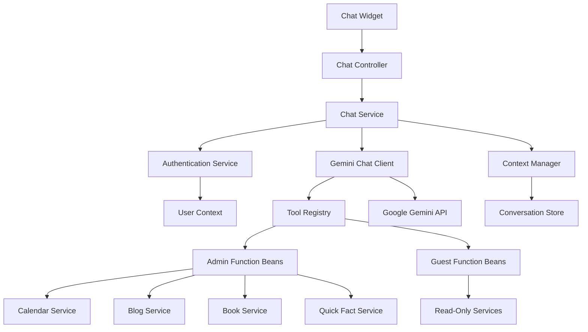

# Design Document: Agentic Chat Interface

## Overview

The Agentic Chat Interface serves as the core conversational AI system for the Personal Agentic Dashboard, integrating Spring AI with Google Gemini to provide natural language interactions with role-based tool access. The system enables Guest users to query public data through read-only interactions, while Admin users gain access to powerful function calling capabilities that allow the AI to execute system modifications, manage content, and control external services.

The design leverages Spring AI's function calling framework to register Java methods as AI tools, with dynamic tool availability based on user authentication status. The system maintains conversation context, handles errors gracefully, and provides a seamless bridge between natural language requests and system functionality.

## Architecture



The architecture implements a layered approach with clear separation of concerns:

1. **Presentation Layer**: Chat controller handles HTTP requests and responses
2. **Service Layer**: Core chat logic, authentication validation, and context management
3. **Integration Layer**: Spring AI client manages Gemini communication and function calling
4. **Tool Layer**: Dynamic function registry with role-based tool availability
5. **External Layer**: Google Gemini API and various system services

## Components and Interfaces

### Core Components

**ChatController**
- Handles `/api/chat` POST endpoint
- Validates request format and extracts authentication tokens
- Manages HTTP response formatting and error handling
- Integrates with authentication service for user context

**ChatService**
- Core business logic for message processing
- Orchestrates Gemini client calls with appropriate tool sets
- Manages conversation context and session state
- Handles error scenarios and fallback responses

**GeminiChatClient**
- Spring AI client wrapper for Google Gemini integration
- Manages API configuration, rate limiting, and retry logic
- Handles function calling orchestration with tool registry
- Processes streaming responses and context management

**ToolRegistry**
- Dynamic function registration system based on user roles
- Manages Spring AI function beans with @Description annotations
- Provides role-based tool filtering and access control
- Handles function execution validation and error handling

**ConversationContextManager**
- Maintains chat history and session context
- Implements intelligent context truncation for token limits
- Manages context persistence and cleanup
- Provides context retrieval for multi-turn conversations

### Data Models

**ChatRequest**
```java
public class ChatRequest {
    private String message;
    private String sessionId;
    private Map<String, Object> context;
}
```

**ChatResponse**
```java
public class ChatResponse {
    private String message;
    private String sessionId;
    private boolean success;
    private List<String> availableTools;
    private Map<String, Object> metadata;
}
```

**ConversationContext**
```java
public class ConversationContext {
    private String sessionId;
    private String userId;
    private List<ChatMessage> messages;
    private Map<String, Object> sessionData;
    private Instant lastActivity;
}
```

**ChatMessage**
```java
public class ChatMessage {
    private String role; // "user" or "assistant"
    private String content;
    private Instant timestamp;
    private Map<String, Object> metadata;
}
```

### Function Registration System

**Admin Function Examples**
```java
@Configuration
public class AdminFunctionConfiguration {
    
    @Bean
    @Description("Creates a new blog post with the given title and content")
    public Function<BlogPostRequest, BlogPostResponse> createBlogPost() {
        return request -> blogService.createPost(request.getTitle(), request.getContent());
    }
    
    @Bean
    @Description("Adds an event to the user's Google Calendar")
    public Function<CalendarEventRequest, CalendarEventResponse> addCalendarEvent() {
        return request -> calendarService.addEvent(
            request.getTitle(), 
            request.getDateTime(), 
            request.getDuration()
        );
    }
    
    @Bean
    @Description("Updates a quick fact with a new value")
    public Function<QuickFactRequest, QuickFactResponse> updateQuickFact() {
        return request -> quickFactService.updateFact(request.getKey(), request.getValue());
    }
}
```

**Guest Function Examples**
```java
@Configuration
public class GuestFunctionConfiguration {
    
    @Bean
    @Description("Retrieves public blog posts")
    public Function<BlogQueryRequest, BlogQueryResponse> getBlogPosts() {
        return request -> blogService.getPublicPosts(request.getLimit());
    }
    
    @Bean
    @Description("Gets current portfolio information")
    public Function<PortfolioRequest, PortfolioResponse> getPortfolio() {
        return request -> portfolioService.getPublicPortfolioData();
    }
}
```

## Data Models

### Spring AI Configuration

**Gemini Client Configuration**
```java
@Configuration
public class GeminiConfiguration {
    
    @Value("${spring.ai.vertex.ai.gemini.api-key}")
    private String apiKey;
    
    @Bean
    public VertexAiGeminiChatModel geminiChatModel() {
        return new VertexAiGeminiChatModel(
            VertexAiGeminiChatOptions.builder()
                .withModel("gemini-1.5-pro")
                .withTemperature(0.7f)
                .withMaxTokens(2048)
                .build(),
            ConnectionUtils.getDefaultConnectionDetails(apiKey)
        );
    }
}
```

**Function Calling Configuration**
```java
@Configuration
public class FunctionCallingConfiguration {
    
    @Bean
    public FunctionCallbackWrapper adminFunctionWrapper() {
        return FunctionCallbackWrapper.builder(createBlogPost())
            .withName("createBlogPost")
            .withDescription("Creates a new blog post with the given title and content")
            .withInputType(BlogPostRequest.class)
            .build();
    }
}
```

### Context Management

**Session Storage**
- In-memory storage for active conversations with TTL
- Redis integration for distributed deployments (future enhancement)
- Automatic cleanup of expired sessions
- Context size limits to prevent memory issues

**Context Truncation Strategy**
- Preserve system messages and recent user interactions
- Summarize older conversation history when approaching token limits
- Maintain function call results for context continuity
- Implement sliding window approach for long conversations
## Correctness Properties

*A property is a characteristic or behavior that should hold true across all valid executions of a system—essentially, a formal statement about what the system should do. Properties serve as the bridge between human-readable specifications and machine-verifiable correctness guarantees.*

### Core Chat Functionality Properties

**Property 1: Message processing consistency**
*For any* user message sent to the chat interface, the system should process the message and return a relevant AI-generated response within the specified time limit
**Validates: Requirements 1.1, 1.5**

**Property 2: Conversation context persistence**
*For any* sequence of messages within a session, the chat interface should maintain conversation context and include relevant history in subsequent interactions
**Validates: Requirements 1.2, 7.1, 7.2**

**Property 3: Gemini integration reliability**
*For any* valid chat request, the system should successfully integrate with Google Gemini API and process natural language through Spring AI
**Validates: Requirements 1.3**

**Property 4: Error handling for unclear requests**
*For any* ambiguous, unclear, or invalid user request, the chat interface should provide helpful error messages or clarification requests rather than failing silently
**Validates: Requirements 1.4**

### Authentication and Authorization Properties

**Property 5: Guest user access control**
*For any* chat request from an unauthenticated or guest user, the system should provide read-only access to public data without exposing admin-only function calling capabilities
**Validates: Requirements 2.1, 2.5**

**Property 6: Admin user tool access**
*For any* chat request from an authenticated admin user, the system should enable full function calling capabilities including all system modification tools
**Validates: Requirements 2.2**

**Property 7: Authentication-based tool availability**
*For any* chat request with an authentication token, the system should validate the token and determine tool availability based on the user's authenticated role and permissions
**Validates: Requirements 2.3, 2.4, 5.4**

### Function Calling and Tool Registry Properties

**Property 8: Function registration consistency**
*For any* Java method annotated with @Bean and @Description, the tool registry should properly register it as a callable Spring AI function with correct categorization by permission level
**Validates: Requirements 4.1, 4.2**

**Property 9: Dynamic tool availability**
*For any* user role (guest or admin), the tool registry should dynamically enable the appropriate function set and validate permissions before allowing function execution
**Validates: Requirements 4.3, 4.4**

**Property 10: Function description provision**
*For any* registered function, the tool registry should provide clear descriptions to Gemini for appropriate tool selection during function calling
**Validates: Requirements 4.5**

**Property 11: Function execution reliability**
*For any* function calling request from Gemini, the system should execute the appropriate Java method and return results to Gemini for response generation
**Validates: Requirements 3.4**

### API and Communication Properties

**Property 12: API endpoint consistency**
*For any* POST request to `/api/chat`, the system should validate the request format, extract the user message and authentication token, and return responses in structured JSON format
**Validates: Requirements 5.1, 5.2, 5.3**

**Property 13: Concurrent request handling**
*For any* set of concurrent chat requests from multiple users, the system should handle them without interference and maintain separate conversation contexts
**Validates: Requirements 5.5**

**Property 14: Spring AI configuration validity**
*For any* system startup with valid API keys, the chat interface should successfully configure Spring AI with Google Gemini integration and register function callbacks
**Validates: Requirements 3.1, 3.2**

### Error Handling and Resilience Properties

**Property 15: API error handling**
*For any* Gemini API failure or function calling error, the system should handle exceptions gracefully and provide user-friendly error messages without exposing technical details
**Validates: Requirements 6.1, 6.2**

**Property 16: Retry mechanism reliability**
*For any* transient API failure, the system should implement retry logic with exponential backoff and handle rate limits appropriately
**Validates: Requirements 6.3, 3.5, 6.4**

**Property 17: Privacy-preserving error logging**
*For any* error that occurs during chat processing, the system should log appropriate debugging information while maintaining user privacy and not exposing sensitive data
**Validates: Requirements 6.5**

### Context Management Properties

**Property 18: Context size management**
*For any* conversation that approaches token limits, the system should intelligently truncate older messages while preserving important information and preventing token limit exceeded errors
**Validates: Requirements 7.3, 7.4**

**Property 19: Session context lifecycle**
*For any* new session or explicit context clearing request, the system should properly clear conversation context and start fresh while maintaining session isolation
**Validates: Requirements 7.5**

## Error Handling

### Gemini API Errors

**API Connection Failures**
- Implement exponential backoff retry strategy (1s, 2s, 4s, 8s intervals)
- Return user-friendly messages for persistent connection issues
- Log technical details for debugging while preserving user privacy
- Fallback to cached responses for common queries when possible

**Rate Limit Exceeded**
- Queue non-urgent requests with priority-based processing
- Inform users of temporary delays with estimated wait times
- Implement request throttling to prevent future rate limit hits
- Cache frequently requested information to reduce API calls

**Invalid API Responses**
- Validate Gemini response format and content
- Handle malformed JSON or unexpected response structures
- Provide fallback responses for critical system functions
- Log response anomalies for monitoring and debugging

### Function Calling Errors

**Function Execution Failures**
- Catch and handle all function exceptions gracefully
- Provide meaningful error messages to users about failed operations
- Implement rollback mechanisms for partially completed operations
- Log function errors with context for debugging

**Permission Validation Errors**
- Reject unauthorized function calls with clear error messages
- Log security violations for monitoring and alerting
- Ensure no sensitive information is exposed in error responses
- Maintain audit trail of permission-related failures

### Context Management Errors

**Context Size Exceeded**
- Implement intelligent truncation preserving recent and important messages
- Summarize older conversation history when approaching limits
- Maintain function call results and system messages
- Provide users with context reset options when needed

**Session Management Failures**
- Handle session expiration gracefully with re-authentication prompts
- Implement session cleanup for memory management
- Provide session recovery mechanisms for temporary failures
- Maintain conversation continuity across session boundaries when possible

## Testing Strategy

### Dual Testing Approach

The agentic chat interface requires comprehensive testing combining unit tests and property-based tests:

**Unit Tests** verify specific scenarios and integration points:
- Specific conversation flows with known inputs and expected outputs
- Authentication token validation with various token states
- Function calling integration with mock services
- Error handling for specific API failure scenarios
- Context management edge cases and boundary conditions

**Property Tests** verify universal behaviors across all inputs:
- Message processing consistency across all message types and user roles
- Authentication and authorization rules across all token and role combinations
- Function calling behavior across all registered functions and permission levels
- Error handling consistency across all failure scenarios
- Context management across all conversation patterns and session states

### Property-Based Testing Configuration

**Testing Framework**: Use JUnit 5 with jqwik for property-based testing
- Minimum 100 iterations per property test for comprehensive coverage
- Each property test references its design document property
- Tag format: **Feature: agentic-chat-interface, Property {number}: {property_text}**

**Test Data Generation**:
- Generate random user messages with various content types and lengths
- Create different authentication token states (valid admin, valid guest, invalid, expired)
- Generate conversation sequences of varying lengths and complexity
- Simulate API failures, rate limits, and network issues
- Create edge cases for context size limits and session management

**Integration Testing**:
- Test complete chat flows from HTTP request to AI response
- Verify Spring AI and Gemini API integration with real API calls
- Test function calling with actual service implementations
- Validate conversation context persistence and management
- Test concurrent user scenarios and session isolation

**Mock and Stub Strategy**:
- Mock Gemini API for predictable testing scenarios
- Stub function services for isolated chat logic testing
- Use real integrations for end-to-end validation
- Implement test doubles for error scenario simulation