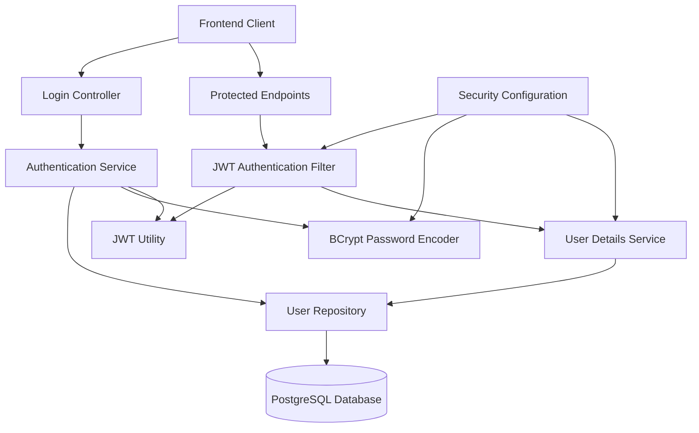

# Design Document: Authentication System

## Overview

The Authentication System provides secure user authentication and authorization for the Personal Agentic Dashboard using Spring Boot 3.2+ and Spring Security 6. The system implements JWT-based stateless authentication with role-based access control, differentiating between Guest users (read-only access) and Admin users (full access with AI agent tools).

The design follows modern Spring Security patterns with custom JWT filters, secure password hashing using BCrypt, and PostgreSQL database persistence. The system integrates seamlessly with the existing Spring Boot application structure and provides the foundation for the AI agent's permission-based tool access.

## Architecture



The architecture implements a layered security approach:

1. **Presentation Layer**: REST controllers handle authentication requests
2. **Security Layer**: Spring Security filters intercept and validate requests
3. **Service Layer**: Business logic for authentication and user management
4. **Data Layer**: JPA repositories with PostgreSQL database persistence

## Components and Interfaces

### Core Components

**AuthenticationController**
- Handles `/api/auth/login` endpoint
- Handles `/api/auth/me` endpoint for current user information
- Validates login requests and returns JWT tokens
- Manages authentication error responses
- Extracts user information from JWT tokens

**JwtAuthenticationFilter**
- Custom Spring Security filter for JWT validation
- Extracts and validates JWT tokens from requests
- Sets authentication context for authorized requests

**AuthenticationService**
- Core business logic for user authentication
- Integrates with UserRepository for credential validation
- Manages JWT token generation and validation

**JwtUtil**
- Utility class for JWT token operations
- Handles token generation, validation, and parsing
- Manages token expiration and signing

**UserDetailsServiceImpl**
- Spring Security UserDetailsService implementation
- Loads user details for authentication
- Bridges JPA entities with Spring Security

### Data Models

**User Entity**
```java
@Entity
@Table(name = "users")
public class User {
    @Id
    private String username;
    
    @Column(nullable = false)
    private String passwordHash;
    
    @Enumerated(EnumType.STRING)
    private Role role = Role.ADMIN; // Default role for single-user system
    
    // Constructors, getters, setters
}
```

**Role Enumeration**
```java
public enum Role {
    GUEST,  // Read-only access
    ADMIN   // Full access with AI agent tools
}
```

**Authentication Request/Response DTOs**
```java
public class LoginRequest {
    private String username;
    private String password;
}

public class AuthResponse {
    private String token;
    private String type = "Bearer";
    private String username;
    private Role role;
}
```

### Security Configuration

**SecurityFilterChain Configuration**
- Configures JWT authentication filter
- Defines public and protected endpoints
- Sets up CORS and CSRF policies
- Configures password encoding

**JWT Configuration Properties**
- JWT secret key for token signing
- Token expiration time (configurable)
- Token issuer and audience claims

## Data Models

### Database Schema

**users Table**
```sql
CREATE TABLE users (
    username VARCHAR(50) PRIMARY KEY,
    password_hash VARCHAR(255) NOT NULL,
    role VARCHAR(20) NOT NULL DEFAULT 'ADMIN',
    created_at TIMESTAMP DEFAULT CURRENT_TIMESTAMP,
    updated_at TIMESTAMP DEFAULT CURRENT_TIMESTAMP ON UPDATE CURRENT_TIMESTAMP
);
```

### PostgreSQL Database Configuration

**Database Connection**
- Database host: `localhost:5432` (configurable)
- Database name: `personal_platform`
- Connection pooling with HikariCP
- Automatic schema generation via JPA

**Application Properties Configuration**
```properties
# PostgreSQL Database
spring.datasource.url=jdbc:postgresql://localhost:5432/personal_platform
spring.datasource.driver-class-name=org.postgresql.Driver
spring.datasource.username=admin
spring.datasource.password=password

# JPA Configuration
spring.jpa.hibernate.ddl-auto=update
spring.jpa.show-sql=false
spring.jpa.properties.hibernate.dialect=org.hibernate.dialect.PostgreSQLDialect
spring.jpa.properties.hibernate.format_sql=true
```

## Correctness Properties

*A property is a characteristic or behavior that should hold true across all valid executions of a system—essentially, a formal statement about what the system should do. Properties serve as the bridge between human-readable specifications and machine-verifiable correctness guarantees.*

### Authentication Properties

**Property 1: Valid credential authentication**
*For any* valid username and password combination in the system, submitting these credentials to the login endpoint should return a valid JWT token with 200 status
**Validates: Requirements 1.1, 5.2**

**Property 2: Invalid credential rejection**
*For any* invalid username and password combination, submitting these credentials to the login endpoint should return a 401 status with an error message
**Validates: Requirements 1.2, 5.3**

**Property 3: Malformed request validation**
*For any* malformed login request (missing fields, wrong format, invalid JSON), the login endpoint should return a 400 status with validation error details
**Validates: Requirements 1.3, 5.4**

**Property 4: Password hashing security**
*For any* password provided during user creation, the stored password hash should never equal the plaintext password and should be generated using a secure hashing algorithm
**Validates: Requirements 1.4, 1.5, 4.3**

### Authentication Persistence Properties

**Property 5: Token-based user information retrieval**
*For any* valid JWT token, the `/api/auth/me` endpoint should extract the username from the token and return the corresponding user information
**Validates: Requirements 7.2, 7.3**

**Property 6: Invalid token rejection for user info**
*For any* invalid, expired, or missing JWT token, the `/api/auth/me` endpoint should return a 401 unauthorized response
**Validates: Requirements 7.4**

**Property 7: Authentication state persistence**
*For any* valid stored JWT token, the frontend should be able to restore user authentication state without requiring re-login
**Validates: Requirements 7.1, 7.5**

### Authorization Properties

**Property 8: Guest user access control**
*For any* request made without authentication credentials, the system should allow access to public endpoints but reject access to protected endpoints
**Validates: Requirements 2.1, 6.2**

**Property 9: Admin user access control**
*For any* request made with valid admin authentication, the system should allow access to all endpoints including protected AI agent tools
**Validates: Requirements 2.2, 6.2**

**Property 10: Token validation consistency**
*For any* JWT token (valid, invalid, expired, or malformed), the authentication system should consistently validate the token and reject invalid/expired tokens with 401 status across all protected endpoints
**Validates: Requirements 2.3, 2.4, 3.3**

### Token Management Properties

**Property 11: JWT token structure**
*For any* generated JWT token, it should contain an expiration time, user role information, and be properly signed with the configured secret
**Validates: Requirements 2.5, 3.1**

**Property 12: API format consistency**
*For any* request to authentication endpoints, they should accept JSON input and return JSON output with appropriate HTTP status codes
**Validates: Requirements 5.1, 5.5**

### Data Persistence Properties

**Property 13: Username uniqueness enforcement**
*For any* attempt to create a user with an existing username, the system should reject the creation and maintain database integrity
**Validates: Requirements 4.2**

**Property 14: Password hash confidentiality**
*For any* API response containing user data, password hashes should never be included in the response payload
**Validates: Requirements 4.4**

**Property 15: Authentication context availability**
*For any* authenticated request to a protected endpoint, the Spring Security authentication context should be properly populated and available to controllers
**Validates: Requirements 6.3**

## Error Handling

### Authentication Errors

**Invalid Credentials**
- Return 401 Unauthorized with descriptive error message
- Log authentication attempts for security monitoring
- Implement rate limiting to prevent brute force attacks

**Malformed Requests**
- Return 400 Bad Request with validation error details
- Validate JSON structure and required fields
- Provide clear error messages for missing or invalid data

**Token Validation Errors**
- Return 401 Unauthorized for invalid/expired tokens
- Handle missing Authorization header gracefully
- Validate JWT signature and claims

### System Errors

**Database Connection Issues**
- Return 503 Service Unavailable for database connectivity problems
- Implement connection retry logic with exponential backoff
- Log database errors for monitoring and debugging

**Configuration Errors**
- Fail fast on startup for missing JWT secret or invalid configuration
- Validate PostgreSQL database connectivity and schema creation
- Ensure proper Spring Security filter chain configuration

## Testing Strategy

### Dual Testing Approach

The authentication system requires both unit tests and property-based tests to ensure comprehensive coverage:

**Unit Tests** verify specific examples, edge cases, and error conditions:
- Specific login scenarios with known credentials
- JWT token parsing and validation edge cases
- Spring Security filter integration points
- Database entity mapping and constraints

**Property Tests** verify universal properties across all inputs:
- Authentication behavior across all possible credential combinations
- Token validation consistency across all token types
- Authorization rules across all endpoint and user combinations
- Password hashing security across all password inputs

### Property-Based Testing Configuration

**Testing Framework**: Use JUnit 5 with jqwik for property-based testing in Java
- Minimum 100 iterations per property test
- Each property test references its design document property
- Tag format: **Feature: authentication-system, Property {number}: {property_text}**

**Test Data Generation**:
- Generate random usernames, passwords, and credential combinations
- Create various JWT token states (valid, expired, malformed, missing)
- Generate malformed JSON requests and edge case inputs
- Use realistic but randomized test data for comprehensive coverage

**Integration Testing**:
- Test complete authentication flows from HTTP request to database
- Verify Spring Security filter chain behavior
- Test PostgreSQL database persistence and connection pooling
- Validate JWT token lifecycle from generation to expiration