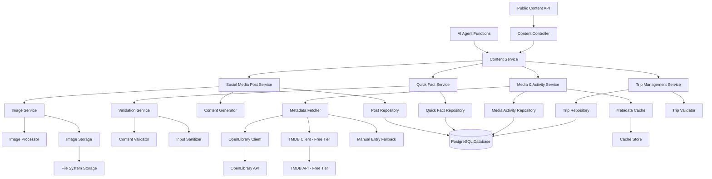

# Design Document: Content Management

## Overview

The Content Management system provides comprehensive content creation and management capabilities for the Personal Agentic Dashboard, enabling AI-powered content operations through natural language interactions. The system manages three primary content types: social media-style posts with images and comments, dynamic quick facts for personal information, and a comprehensive media & activities tracker covering books, movies, TV shows, podcasts, music, magazines, and upcoming trips.

The design implements a service-oriented architecture with clear separation between content types, robust validation and sanitization, external API integration with caching (using only free APIs like OpenLibrary and TMDB free tier), and both AI agent function calling and public REST API access. The system ensures data integrity while providing flexible content management through conversational AI interactions.

## Architecture



The architecture separates concerns across multiple layers:

1. **API Layer**: REST controllers for public content access and AI function integration
2. **Service Layer**: Business logic for each content type with validation and processing
3. **Repository Layer**: Data access and persistence with PostgreSQL database integration
4. **Integration Layer**: External API clients and caching mechanisms (OpenLibrary, TMDB free tier)
5. **Validation Layer**: Content validation, sanitization, and data integrity enforcement

## Components and Interfaces

### Core Services

**ContentService**
- Central orchestration service for all content operations
- Coordinates between social media posts, quick facts, media activities, and trip services
- Provides unified error handling and response formatting
- Manages cross-content-type operations and dependencies

**SocialMediaPostService**
- Handles social media post creation, updates, and retrieval with image support
- Integrates with AI content generation for post content creation
- Manages image processing, storage, and comment functionality
- Provides post feed display and filtering capabilities

**QuickFactService**
- Manages key-value quick fact storage and retrieval
- Handles automatic timestamp tracking for updates
- Provides validation for keys and values
- Supports bulk operations and fact categorization

**MediaActivityService**
- Manages comprehensive media and activity tracking across multiple types
- Integrates with external APIs (OpenLibrary, TMDB free tier) for metadata fetching
- Handles activity status tracking, ratings, and progress monitoring
- Provides search and filtering for media collections across all types

**TripService**
- Manages upcoming trip and event planning
- Handles destination, date, and activity information
- Provides trip status tracking and conflict detection
- Supports different trip types and planning workflows

### Data Models

**SocialMediaPost Entity**
```java
@Entity
@Table(name = "social_media_post")
public class SocialMediaPost {
    @Id
    @GeneratedValue(strategy = GenerationType.IDENTITY)
    private Long id;
    
    @Column(columnDefinition = "TEXT")
    private String content;
    
    @Column(name = "published_at")
    private LocalDateTime publishedAt;
    
    @Column(name = "updated_at")
    private LocalDateTime updatedAt;
    
    @ElementCollection
    @CollectionTable(name = "post_images")
    private List<String> imageUrls;
    
    @Column(columnDefinition = "TEXT")
    private String comments;
    
    private String caption;
    
    // Constructors, getters, setters
}
```

**QuickFact Entity**
```java
@Entity
@Table(name = "quick_fact")
public class QuickFact {
    @Id
    private String key;
    
    @Column(nullable = false)
    private String value;
    
    @Column(name = "updated_at")
    private LocalDateTime updatedAt;
    
    private String category;
    private String description;
    
    // Constructors, getters, setters
}
```

**MediaActivity Entity**
```java
@Entity
@Table(name = "media_activity")
public class MediaActivity {
    @Id
    @GeneratedValue(strategy = GenerationType.IDENTITY)
    private Long id;
    
    @Column(nullable = false)
    private String title;
    
    @Enumerated(EnumType.STRING)
    @Column(name = "media_type")
    private MediaType mediaType; // BOOK, MOVIE, TV_SHOW, PODCAST, SONG, ALBUM, MAGAZINE
    
    @Enumerated(EnumType.STRING)
    private ActivityStatus status; // CURRENTLY_ENGAGED, COMPLETED, PLANNED, PAUSED
    
    private String creator; // Author, Director, Artist, etc.
    
    @Column(name = "cover_url")
    private String coverUrl;
    
    private Integer rating; // 1-5 scale
    
    @Column(name = "start_date")
    private LocalDate startDate;
    
    @Column(name = "completion_date")
    private LocalDate completionDate;
    
    private String notes;
    
    // External metadata
    private String externalId; // ISBN, IMDB ID, Spotify ID, etc.
    private String publisher;
    private Integer releaseYear;
    private String genre;
    
    @Column(name = "created_at")
    private LocalDateTime createdAt;
    
    @Column(name = "updated_at")
    private LocalDateTime updatedAt;
    
    // Constructors, getters, setters
}
```

**UpcomingTrip Entity**
```java
@Entity
@Table(name = "upcoming_trip")
public class UpcomingTrip {
    @Id
    @GeneratedValue(strategy = GenerationType.IDENTITY)
    private Long id;
    
    @Column(nullable = false)
    private String destination;
    
    @Column(name = "start_date")
    private LocalDate startDate;
    
    @Column(name = "end_date")
    private LocalDate endDate;
    
    @Enumerated(EnumType.STRING)
    @Column(name = "trip_type")
    private TripType tripType; // VACATION, BUSINESS, EVENT, CONFERENCE
    
    @Column(columnDefinition = "TEXT")
    private String description;
    
    @Column(name = "planned_activities", columnDefinition = "TEXT")
    private String plannedActivities;
    
    @Enumerated(EnumType.STRING)
    private TripStatus status; // PLANNED, CONFIRMED, IN_PROGRESS, COMPLETED, CANCELLED
    
    @Column(name = "created_at")
    private LocalDateTime createdAt;
    
    @Column(name = "updated_at")
    private LocalDateTime updatedAt;
    
    // Constructors, getters, setters
}
```

### Request/Response DTOs

**SocialMediaPostRequest**
```java
public class SocialMediaPostRequest {
    private String content;
    private List<MultipartFile> images;
    private String comments;
    private String caption;
}
```

**QuickFactRequest**
```java
public class QuickFactRequest {
    private String key;
    private String value;
    private String category;
    private String description;
}
```

**MediaActivityRequest**
```java
public class MediaActivityRequest {
    private String title;
    private MediaType mediaType;
    private String creator;
    private ActivityStatus status;
    private Integer rating;
    private LocalDate startDate;
    private LocalDate completionDate;
    private String notes;
    private String externalId; // For API lookup
}
```

**TripRequest**
```java
public class TripRequest {
    private String destination;
    private LocalDate startDate;
    private LocalDate endDate;
    private TripType tripType;
    private String description;
    private String plannedActivities;
    private TripStatus status;
}
```

**ContentResponse**
```java
public class ContentResponse<T> {
    private T data;
    private boolean success;
    private String message;
    private Map<String, Object> metadata;
    private Instant timestamp;
}
```

### External API Integration

**OpenLibrary Client Configuration**
```java
@Component
public class OpenLibraryClient {
    
    @Value("${openlibrary.api.base.url:https://openlibrary.org}")
    private String baseUrl;
    
    @Value("${openlibrary.api.timeout:10000}")
    private int timeoutMs;
    
    private final RestTemplate restTemplate;
    private final ObjectMapper objectMapper;
    
    public BookMetadata searchByTitle(String title) {
        String url = baseUrl + "/search.json?title=" + URLEncoder.encode(title, StandardCharsets.UTF_8);
        // Implementation with retry logic and error handling
    }
    
    public BookMetadata getByISBN(String isbn) {
        String url = baseUrl + "/api/books?bibkeys=ISBN:" + isbn + "&format=json&jscmd=data";
        // Implementation with caching and validation
    }
}
```

**TMDB Client Configuration (Free Tier)**
```java
@Component
public class TMDBClient {
    
    @Value("${tmdb.api.base.url:https://api.themoviedb.org/3}")
    private String baseUrl;
    
    @Value("${tmdb.api.key}")
    private String apiKey;
    
    @Value("${tmdb.api.timeout:10000}")
    private int timeoutMs;
    
    private final RestTemplate restTemplate;
    
    public MovieMetadata searchMovie(String title) {
        String url = baseUrl + "/search/movie?api_key=" + apiKey + "&query=" + URLEncoder.encode(title, StandardCharsets.UTF_8);
        // Implementation with rate limiting and caching
    }
    
    public TVShowMetadata searchTVShow(String title) {
        String url = baseUrl + "/search/tv?api_key=" + apiKey + "&query=" + URLEncoder.encode(title, StandardCharsets.UTF_8);
        // Implementation with error handling
    }
}
```

**Metadata Response Models**
```java
public class BookMetadata {
    private String title;
    private List<String> authors;
    private String isbn;
    private String coverUrl;
    private String publisher;
    private Integer publishYear;
    private String description;
}

public class MovieMetadata {
    private String title;
    private String director;
    private String posterUrl;
    private Integer releaseYear;
    private String genre;
    private String overview;
    private String imdbId;
}

public class TVShowMetadata {
    private String title;
    private String creator;
    private String posterUrl;
    private Integer firstAirYear;
    private String genre;
    private String overview;
    private Integer numberOfSeasons;
}
```

## Data Models

### Content Generation Integration

**AI Content Generation**
```java
@Service
public class ContentGeneratorService {
    
    private final GeminiChatClient geminiClient;
    
    public String generatePostContent(String prompt) {
        String fullPrompt = String.format(
            "Create a social media post based on this prompt: '%s'. " +
            "Make it engaging and personal, suitable for a personal dashboard. " +
            "Keep it concise but meaningful, and format it appropriately for social media display.",
            prompt
        );
        
        return geminiClient.generateContent(fullPrompt);
    }
    
    public String generatePostCaption(String content) {
        String prompt = "Create a brief, engaging caption for this social media post: " + content;
        return geminiClient.generateContent(prompt);
    }
}
```

### Image Processing Service

**Image Processing and Storage**
```java
@Service
public class ImageService {
    
    @Value("${content.images.upload.path:/app/uploads/images}")
    private String uploadPath;
    
    @Value("${content.images.max.size:5242880}") // 5MB
    private long maxFileSize;
    
    public List<String> processAndStoreImages(List<MultipartFile> images) {
        List<String> imageUrls = new ArrayList<>();
        
        for (MultipartFile image : images) {
            validateImage(image);
            String filename = generateUniqueFilename(image.getOriginalFilename());
            
            // Resize and optimize image
            BufferedImage processedImage = resizeImage(image, 800, 600);
            String imagePath = saveImage(processedImage, filename);
            
            imageUrls.add(imagePath);
        }
        
        return imageUrls;
    }
    
    private void validateImage(MultipartFile image) {
        if (image.getSize() > maxFileSize) {
            throw new InvalidImageException("Image size exceeds maximum allowed size");
        }
        
        String contentType = image.getContentType();
        if (!Arrays.asList("image/jpeg", "image/png", "image/webp").contains(contentType)) {
            throw new InvalidImageException("Unsupported image format");
        }
    }
    
    private BufferedImage resizeImage(MultipartFile image, int maxWidth, int maxHeight) {
        // Image resizing implementation with aspect ratio preservation
    }
}
```

### Validation and Sanitization

**Content Validation Service**
```java
@Service
public class ContentValidationService {
    
    public ValidationResult validateSocialMediaPost(SocialMediaPostRequest request) {
        ValidationResult result = new ValidationResult();
        
        // Content validation
        if (StringUtils.isBlank(request.getContent()) && 
            (request.getImages() == null || request.getImages().isEmpty())) {
            result.addError("content", "Post must have either text content or images");
        }
        
        if (request.getContent() != null && request.getContent().length() > 2000) {
            result.addError("content", "Post content must be less than 2000 characters");
        }
        
        // Image validation
        if (request.getImages() != null && request.getImages().size() > 10) {
            result.addError("images", "Maximum 10 images allowed per post");
        }
        
        return result;
    }
    
    public ValidationResult validateMediaActivity(MediaActivityRequest request) {
        ValidationResult result = new ValidationResult();
        
        if (StringUtils.isBlank(request.getTitle())) {
            result.addError("title", "Title is required");
        }
        
        if (request.getMediaType() == null) {
            result.addError("mediaType", "Media type is required");
        }
        
        if (request.getRating() != null && (request.getRating() < 1 || request.getRating() > 5)) {
            result.addError("rating", "Rating must be between 1 and 5");
        }
        
        return result;
    }
    
    public ValidationResult validateTrip(TripRequest request) {
        ValidationResult result = new ValidationResult();
        
        if (StringUtils.isBlank(request.getDestination())) {
            result.addError("destination", "Destination is required");
        }
        
        if (request.getStartDate() != null && request.getEndDate() != null && 
            request.getStartDate().isAfter(request.getEndDate())) {
            result.addError("dates", "Start date must be before end date");
        }
        
        return result;
    }
    
    public String sanitizeInput(String input) {
        // Remove potentially harmful content while preserving formatting
        return Jsoup.clean(input, Safelist.basicWithImages());
    }
}
```

### Caching Strategy

**Metadata Cache Implementation**
```java
@Component
public class MetadataCacheManager {
    
    private final Cache<String, BookMetadata> bookMetadataCache;
    private final Cache<String, MovieMetadata> movieMetadataCache;
    private final Cache<String, TVShowMetadata> tvShowMetadataCache;
    private final Cache<String, String> contentCache;
    
    @Value("${content.cache.ttl.hours:24}")
    private int cacheTtlHours;
    
    public MetadataCacheManager() {
        this.bookMetadataCache = Caffeine.newBuilder()
            .maximumSize(1000)
            .expireAfterWrite(cacheTtlHours, TimeUnit.HOURS)
            .build();
            
        this.movieMetadataCache = Caffeine.newBuilder()
            .maximumSize(1000)
            .expireAfterWrite(cacheTtlHours, TimeUnit.HOURS)
            .build();
            
        this.tvShowMetadataCache = Caffeine.newBuilder()
            .maximumSize(1000)
            .expireAfterWrite(cacheTtlHours, TimeUnit.HOURS)
            .build();
            
        this.contentCache = Caffeine.newBuilder()
            .maximumSize(500)
            .expireAfterWrite(1, TimeUnit.HOURS)
            .build();
    }
    
    public Optional<BookMetadata> getCachedBookMetadata(String key) {
        return Optional.ofNullable(bookMetadataCache.getIfPresent(key));
    }
    
    public Optional<MovieMetadata> getCachedMovieMetadata(String key) {
        return Optional.ofNullable(movieMetadataCache.getIfPresent(key));
    }
    
    public Optional<TVShowMetadata> getCachedTVShowMetadata(String key) {
        return Optional.ofNullable(tvShowMetadataCache.getIfPresent(key));
    }
    
    public void cacheBookMetadata(String key, BookMetadata metadata) {
        bookMetadataCache.put(key, metadata);
    }
    
    public void cacheMovieMetadata(String key, MovieMetadata metadata) {
        movieMetadataCache.put(key, metadata);
    }
    
    public void cacheTVShowMetadata(String key, TVShowMetadata metadata) {
        tvShowMetadataCache.put(key, metadata);
    }
}
```

### Database Schema Design

**Social Media Post Table**
```sql
CREATE TABLE social_media_post (
    id BIGSERIAL PRIMARY KEY,
    content TEXT,
    published_at TIMESTAMP DEFAULT CURRENT_TIMESTAMP,
    updated_at TIMESTAMP DEFAULT CURRENT_TIMESTAMP,
    comments TEXT,
    caption VARCHAR(500)
);

CREATE TABLE post_images (
    social_media_post_id BIGINT REFERENCES social_media_post(id) ON DELETE CASCADE,
    image_urls VARCHAR(1000)
);
```

**Quick Fact Table**
```sql
CREATE TABLE quick_fact (
    key VARCHAR(100) PRIMARY KEY,
    value TEXT NOT NULL,
    updated_at TIMESTAMP DEFAULT CURRENT_TIMESTAMP,
    category VARCHAR(50),
    description VARCHAR(500)
);
```

**Media Activity Table**
```sql
CREATE TABLE media_activity (
    id BIGSERIAL PRIMARY KEY,
    title VARCHAR(500) NOT NULL,
    media_type VARCHAR(50) NOT NULL,
    status VARCHAR(50) NOT NULL,
    creator VARCHAR(300),
    cover_url VARCHAR(1000),
    rating INTEGER CHECK (rating >= 1 AND rating <= 5),
    start_date DATE,
    completion_date DATE,
    notes TEXT,
    external_id VARCHAR(100),
    publisher VARCHAR(200),
    release_year INTEGER,
    genre VARCHAR(100),
    created_at TIMESTAMP DEFAULT CURRENT_TIMESTAMP,
    updated_at TIMESTAMP DEFAULT CURRENT_TIMESTAMP
);
```

**Upcoming Trip Table**
```sql
CREATE TABLE upcoming_trip (
    id BIGSERIAL PRIMARY KEY,
    destination VARCHAR(300) NOT NULL,
    start_date DATE,
    end_date DATE,
    trip_type VARCHAR(50),
    description TEXT,
    planned_activities TEXT,
    status VARCHAR(50),
    created_at TIMESTAMP DEFAULT CURRENT_TIMESTAMP,
    updated_at TIMESTAMP DEFAULT CURRENT_TIMESTAMP
);
```
## Correctness Properties

*A property is a characteristic or behavior that should hold true across all valid executions of a system—essentially, a formal statement about what the system should do. Properties serve as the bridge between human-readable specifications and machine-verifiable correctness guarantees.*

### Social Media Post Management Properties

**Property 1: Social media post creation with multiple content types**
*For any* valid combination of text content, images, and comments, the Content_Management_System should create a feed-style post with unique identifier, proper timestamps, and all provided content elements
**Validates: Requirements 1.1, 1.2, 1.3**

**Property 2: Post content validation and limits**
*For any* post creation request, the Content_Management_System should validate content including length limits, required fields, and reject invalid data with specific error messages
**Validates: Requirements 1.4, 6.7, 6.9**

**Property 3: Post update and modification support**
*For any* existing post and valid modification request, the Content_Management_System should successfully update text content, add/remove images, and edit comments while maintaining data integrity
**Validates: Requirements 1.5, 3.5**

### Image Management Properties

**Property 4: Image format support and validation**
*For any* image upload, the Content_Management_System should accept supported formats (JPEG, PNG, WebP), validate file security and size limits, and reject invalid images with appropriate error messages
**Validates: Requirements 2.1, 2.4**

**Property 5: Image processing and optimization**
*For any* uploaded image, the Content_Management_System should automatically resize and optimize for different display contexts while maintaining aspect ratios
**Validates: Requirements 2.2, 2.3**

**Property 6: Image metadata and accessibility support**
*For any* image in a post, the Content_Management_System should support captions and alt text storage and retrieval for accessibility and context
**Validates: Requirements 2.5**

### Comment and Caption Management Properties

**Property 7: Comment and caption functionality**
*For any* post creation or update, the Content_Management_System should allow adding comments and captions that are stored alongside the main content with rich text formatting support
**Validates: Requirements 3.1, 3.2**

**Property 8: Comment validation and editing**
*For any* comment content, the Content_Management_System should validate length limits and formatting, and support editing after post creation
**Validates: Requirements 3.4, 3.5**

### Quick Facts Management Properties

**Property 9: Quick fact update and storage with timestamps**
*For any* valid key and value combination, the Content_Management_System should store quick facts with automatic timestamp tracking and support both individual and bulk retrieval
**Validates: Requirements 4.1, 4.2, 4.5**

**Property 10: Quick fact validation and automatic creation**
*For any* quick fact operation, the Content_Management_System should validate keys and values, automatically create new entries for non-existent keys, and reject invalid data
**Validates: Requirements 4.3, 4.4**

### Media & Activities Tracking Properties

**Property 11: Comprehensive media type support**
*For any* media activity creation, the Content_Management_System should support all specified media types (books, movies, TV shows, podcasts, songs, albums, magazines) with complete metadata storage
**Validates: Requirements 5.1, 5.2**

**Property 12: External API integration with fallback**
*For any* media item addition, the Content_Management_System should attempt metadata fetching from appropriate APIs (OpenLibrary, TMDB) and provide manual entry fallback when API data is unavailable
**Validates: Requirements 5.3, 5.4, 9.1, 9.4**

**Property 13: Media activity status and progress tracking**
*For any* media activity, the Content_Management_System should support updating status, ratings, and progress tracking after initial creation with proper validation
**Validates: Requirements 5.5**

### Trip Management Properties

**Property 14: Trip creation and data storage**
*For any* trip creation request, the Content_Management_System should accept destination, dates, trip type, and description information and store all specified fields with proper validation
**Validates: Requirements 6.1, 6.2**

**Property 15: Trip type support and date validation**
*For any* trip, the Content_Management_System should support different trip types with appropriate metadata and validate dates for logical consistency and scheduling conflicts
**Validates: Requirements 6.3, 6.4**

**Property 16: Trip update functionality**
*For any* existing trip, the Content_Management_System should support updating details, dates, and status as plans change while maintaining data integrity
**Validates: Requirements 6.5**

### Content Validation and Security Properties

**Property 17: Comprehensive content validation**
*For any* content data across all types (posts, activities, trips), the Content_Management_System should validate required fields, data types, format constraints, and enforce content limits
**Validates: Requirements 6.6, 6.9**

**Property 18: Input sanitization and security**
*For any* user input including text content and file uploads, the Content_Management_System should sanitize input to prevent injection attacks and validate external API responses before storage
**Validates: Requirements 6.8, 6.10**

### Public Content API Properties

**Property 19: Content retrieval API endpoints**
*For any* GET request to content endpoints, the Content_Management_System should provide access to posts, quick facts, media activities, and trips in structured JSON format suitable for feed display
**Validates: Requirements 7.1, 7.2**

**Property 20: API error handling and status codes**
*For any* request for non-existent content, the Content_Management_System should return appropriate HTTP status codes and descriptive error messages
**Validates: Requirements 7.3**

**Property 21: Pagination and filtering support**
*For any* large content collection request, the Content_Management_System should support pagination and filtering with chronological ordering and activity type filtering
**Validates: Requirements 7.4**

**Property 22: Content caching for performance**
*For any* frequently accessed content and API responses, the Content_Management_System should implement caching to improve performance and reduce external API calls
**Validates: Requirements 7.5, 9.5**

### AI Agent Integration Properties

**Property 23: AI function bean registration and execution**
*For any* AI agent integration, the Content_Management_System should provide function beans for all content operations and execute them with proper parameter validation and metadata fetching
**Validates: Requirements 8.1, 8.2**

**Property 24: AI function response structure and error handling**
*For any* AI function execution, the Content_Management_System should return structured responses with operation results, handle errors gracefully, and provide meaningful error messages
**Validates: Requirements 8.3, 8.4**

**Property 25: AI operation audit logging**
*For any* AI-initiated content operation, the Content_Management_System should log the operation appropriately for audit trails and debugging purposes
**Validates: Requirements 8.5**

### External API Integration Properties

**Property 26: API failure retry mechanism**
*For any* external API call failure, the Content_Management_System should implement retry logic with exponential backoff to handle transient failures appropriately
**Validates: Requirements 9.2**

**Property 27: API rate limit compliance**
*For any* sequence of external API calls, the Content_Management_System should handle rate limits and quota restrictions without causing system failures across all service providers
**Validates: Requirements 9.3**

## Error Handling

### Content Validation Errors

**Social Media Post Validation**
- Validate content requirements (must have either text or images)
- Check content length limits and image count restrictions
- Ensure image file formats and sizes are within acceptable limits
- Handle image processing failures with appropriate error messages

**Quick Fact Validation**
- Validate key format and length constraints
- Check value content for appropriate data types and size limits
- Ensure key uniqueness and handle update vs. create scenarios
- Validate category and description fields when provided

**Media Activity Validation**
- Validate required fields (title, media type) and optional field formats
- Check rating values are within acceptable ranges (1-5)
- Validate date formats and logical date constraints
- Ensure media type is supported and status values are valid

**Trip Validation**
- Validate required fields (destination) and date logic
- Check for date conflicts and scheduling overlaps
- Ensure trip type is supported and status values are valid
- Validate planned activities and description content

### External API Integration Errors

**OpenLibrary API Failures**
- Handle network connectivity issues with retry mechanisms
- Manage API rate limiting with exponential backoff (1s, 2s, 4s, 8s intervals)
- Process malformed or incomplete API responses gracefully
- Provide fallback mechanisms for manual book entry when API fails

**TMDB API Failures (Free Tier)**
- Handle API quota limits and daily request restrictions
- Manage authentication failures and invalid API key scenarios
- Process incomplete movie/TV show metadata gracefully
- Implement fallback to manual entry for missing content

**API Response Processing**
- Validate API response structure and required fields
- Handle missing or null values in external metadata
- Sanitize external data to prevent security vulnerabilities
- Map external data formats to internal data models consistently

### Content Generation Errors

**AI Content Generation Failures**
- Handle AI service unavailability with appropriate error messages
- Manage content generation timeouts and retry logic
- Validate generated content format and quality
- Provide fallback options for manual content entry

**Image Processing Errors**
- Handle unsupported image formats with clear error messages
- Manage image size and processing failures
- Process corrupted or malicious image files securely
- Ensure image optimization preserves quality and aspect ratios

### Caching and Performance Errors

**Cache Management**
- Handle cache invalidation on content updates across all content types
- Manage cache size limits and memory constraints
- Process cache miss scenarios gracefully for all cached content
- Implement cache warming strategies for frequently accessed content

**Database Operation Errors**
- Handle constraint violations with user-friendly error messages
- Manage transaction rollbacks for failed operations across multiple content types
- Process concurrent access conflicts with appropriate locking
- Ensure data consistency across related content operations (posts with images, activities with metadata)

## Testing Strategy

### Dual Testing Approach

The Content Management system requires comprehensive testing combining unit tests and property-based tests:

**Unit Tests** verify specific scenarios and integration points:
- Specific content creation workflows with known inputs and expected outputs
- External API integration with mock responses and error scenarios (OpenLibrary, TMDB)
- Content validation with specific valid and invalid data examples for all content types
- Image processing with known image files and expected transformations
- Caching behavior with known access patterns and cache states
- AI function integration with mock function calls and responses

**Property Tests** verify universal behaviors across all inputs:
- Content operations consistency across all content types and data combinations
- Validation rules across all possible input variations and edge cases
- External API integration reliability across all response scenarios
- Image processing across all supported formats and sizes
- Caching behavior across all access patterns and data sizes
- AI function calling across all parameter combinations and error conditions

### Property-Based Testing Configuration

**Testing Framework**: Use JUnit 5 with jqwik for property-based testing
- Minimum 100 iterations per property test for comprehensive coverage
- Each property test references its design document property
- Tag format: **Feature: content-management, Property {number}: {property_text}**

**Test Data Generation**:
- Generate random social media posts with various content combinations (text, images, comments)
- Create different media activities across all supported types (books, movies, TV shows, podcasts, music, magazines)
- Generate trip data with various destinations, dates, and trip types
- Create different API response scenarios (success, failure, malformed, partial data)
- Generate various validation scenarios with valid and invalid data combinations
- Simulate image files of different formats, sizes, and quality levels
- Create edge cases for content size limits, special characters, and encoding issues

**Integration Testing**:
- Test complete content workflows from API request to database storage for all content types
- Verify external API integration with real OpenLibrary and TMDB API calls (using test data)
- Test AI content generation with actual AI service integration
- Validate image processing with real image files and transformations
- Test caching behavior with real cache implementations and timing
- Test concurrent operations with multiple simultaneous content operations across different types

**Mock and Stub Strategy**:
- Mock external APIs for predictable testing scenarios
- Stub AI content generation for consistent test results
- Use real integrations for end-to-end validation
- Implement test doubles for error scenario simulation
- Create mock responses for various API failure and success scenarios across all integrated services