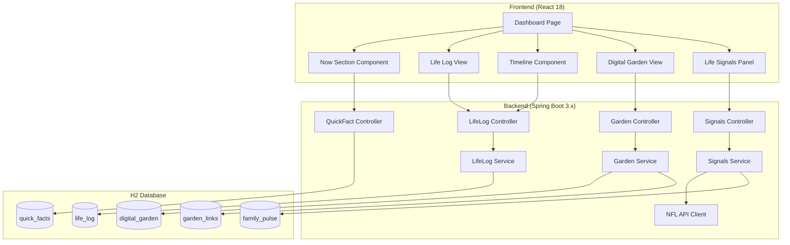

# Design Document: Digital Command Center

## Overview

The Digital Command Center transforms the existing personal dashboard into a comprehensive life-tracking system. This design covers the architecture for a Bento-style dashboard displaying real-time personal status, a unified Life Log for tracking media and hobbies, a chronological Timeline View, a Digital Garden knowledge base, and Life Signals for milestone tracking.

The system uses a Java 21/Spring Boot 3.x backend with H2 file-based persistence, and a React 18 frontend with Tailwind CSS, shadcn/ui components, and framer-motion for animations.

## Architecture



## Components and Interfaces

### Backend Components

#### 1. LifeLog Entity and Repository

```java
@Entity
@Table(name = "life_log")
public class LifeLogEntry {
    @Id
    @GeneratedValue(strategy = GenerationType.IDENTITY)
    private Long id;
    
    @Column(nullable = false)
    private String title;
    
    @Enumerated(EnumType.STRING)
    @Column(nullable = false)
    private LifeLogType type; // BOOK, MOVIE, SHOW, ALBUM, HOBBY
    
    private LocalDate startDate;
    private LocalDate endDate;
    
    @Enumerated(EnumType.STRING)
    private EntryStatus status; // IN_PROGRESS, COMPLETED, PLANNED
    
    // Mahoney Rating System
    private Integer rating; // 1-5
    
    @Column(length = 500)
    private String keyTakeaway;
    
    // Hobby-specific
    private Integer intensity; // 1-5, only for HOBBY type
    
    // Metadata
    private String imageUrl;
    private String externalId;
    
    @Column(length = 1000)
    private String metadata; // JSON for additional type-specific data
    
    private LocalDateTime createdAt;
    private LocalDateTime updatedAt;
}

public enum LifeLogType {
    BOOK, MOVIE, SHOW, ALBUM, HOBBY
}

public enum EntryStatus {
    IN_PROGRESS, COMPLETED, PLANNED
}
```

#### 2. DigitalGarden Entity and Repository

```java
@Entity
@Table(name = "digital_garden")
public class GardenNote {
    @Id
    @GeneratedValue(strategy = GenerationType.IDENTITY)
    private Long id;
    
    @Column(nullable = false)
    private String title;
    
    @Column(columnDefinition = "TEXT")
    private String content;
    
    @Enumerated(EnumType.STRING)
    @Column(nullable = false)
    private GrowthStage growthStage; // SEEDLING, BUDDING, EVERGREEN
    
    @ManyToMany
    @JoinTable(
        name = "garden_lifelog_links",
        joinColumns = @JoinColumn(name = "note_id"),
        inverseJoinColumns = @JoinColumn(name = "lifelog_id")
    )
    private Set<LifeLogEntry> linkedEntries = new HashSet<>();
    
    private LocalDateTime createdAt;
    private LocalDateTime updatedAt;
}

public enum GrowthStage {
    SEEDLING, BUDDING, EVERGREEN
}
```

#### 3. FamilyPulse Entity

```java
@Entity
@Table(name = "family_pulse")
public class FamilyMember {
    @Id
    @GeneratedValue(strategy = GenerationType.IDENTITY)
    private Long id;
    
    @Column(nullable = false)
    private String name;
    
    private String primaryActivity; // e.g., "WSU", "Driving", "School"
    private String status;
    private String notes;
    
    private LocalDateTime updatedAt;
}
```

#### 4. LifeLogService

```java
@Service
public class LifeLogService {
    
    public List<LifeLogEntry> getAllEntries(LifeLogType type, EntryStatus status);
    public LifeLogEntry getEntryById(Long id);
    public LifeLogEntry createEntry(LifeLogEntryRequest request);
    public LifeLogEntry updateEntry(Long id, LifeLogEntryRequest request);
    public void deleteEntry(Long id);
    
    // Timeline-specific queries
    public List<LifeLogEntry> getEntriesInDateRange(LocalDate start, LocalDate end);
    public List<LifeLogEntry> getEntriesByTypes(List<LifeLogType> types, LocalDate start, LocalDate end);
    public List<LifeLogEntry> getActiveEntries(); // entries with no endDate or endDate >= today
}
```

#### 5. GardenService

```java
@Service
public class GardenService {
    
    public List<GardenNote> getAllNotes(GrowthStage stage);
    public GardenNote getNoteById(Long id);
    public GardenNote createNote(GardenNoteRequest request);
    public GardenNote updateNote(Long id, GardenNoteRequest request);
    public void deleteNote(Long id);
    
    // Linking operations
    public GardenNote linkToLifeLog(Long noteId, Long lifeLogId);
    public GardenNote unlinkFromLifeLog(Long noteId, Long lifeLogId);
    public List<GardenNote> getNotesLinkedToEntry(Long lifeLogId);
}
```

#### 6. SignalsService

```java
@Service
public class SignalsService {
    
    // Bears Tracker
    public BearsGameInfo getNextGame();
    public BearsGameInfo getLastGameResult();
    
    // Berkeley Countdown
    public CountdownInfo getBerkeleyCountdown();
    
    // Family Pulse
    public List<FamilyMember> getFamilyPulse();
    public FamilyMember updateFamilyMember(Long id, FamilyMemberRequest request);
}
```

### Frontend Components

#### 1. Dashboard Layout (Bento Grid)

```typescript
interface DashboardProps {
    // No props - fetches data internally
}

// Main dashboard with Bento grid layout
const Dashboard: React.FC<DashboardProps> = () => {
    // Grid areas: now-section, life-log, timeline, garden, signals
};
```

#### 2. NowSection Component

```typescript
interface NowSectionProps {
    quickFacts: QuickFact[];
    onEdit: (fact: QuickFact) => void;
}

interface QuickFact {
    key: string;
    value: string;
    category: 'work' | 'location' | 'hobby' | 'mood' | 'other';
    icon?: string;
}
```

#### 3. Timeline Component

```typescript
interface TimelineProps {
    entries: LifeLogEntry[];
    filters: LifeLogType[];
    dateRange: { start: Date; end: Date };
    orientation: 'horizontal' | 'vertical';
    onEntryClick: (entry: LifeLogEntry) => void;
    onFilterChange: (types: LifeLogType[]) => void;
}

interface LifeLogEntry {
    id: number;
    title: string;
    type: 'BOOK' | 'MOVIE' | 'SHOW' | 'ALBUM' | 'HOBBY';
    startDate: string;
    endDate?: string;
    status: 'IN_PROGRESS' | 'COMPLETED' | 'PLANNED';
    rating?: number;
    keyTakeaway?: string;
    intensity?: number;
    imageUrl?: string;
}
```

#### 4. DigitalGarden Component

```typescript
interface DigitalGardenProps {
    notes: GardenNote[];
    filterStage?: GrowthStage;
    onNoteClick: (note: GardenNote) => void;
    onCreateNote: () => void;
}

interface GardenNote {
    id: number;
    title: string;
    content: string;
    growthStage: 'SEEDLING' | 'BUDDING' | 'EVERGREEN';
    linkedEntries: LifeLogEntry[];
    createdAt: string;
    updatedAt: string;
}
```

#### 5. LifeSignals Component

```typescript
interface LifeSignalsProps {
    bearsGame?: BearsGameInfo;
    berkeleyCountdown: CountdownInfo;
    familyPulse: FamilyMember[];
    onFamilyUpdate: (member: FamilyMember) => void;
}

interface BearsGameInfo {
    opponent: string;
    gameDate: string;
    gameTime?: string;
    isCompleted: boolean;
    homeScore?: number;
    awayScore?: number;
    isHome: boolean;
}

interface CountdownInfo {
    targetDate: string;
    daysRemaining: number;
    label: string;
    isPast: boolean;
}

interface FamilyMember {
    id: number;
    name: string;
    primaryActivity: string;
    status?: string;
}
```

### API Endpoints

#### LifeLog Endpoints

| Method | Endpoint | Description |
|--------|----------|-------------|
| GET | `/api/lifelog` | Get all entries with optional filters |
| GET | `/api/lifelog/{id}` | Get entry by ID |
| POST | `/api/lifelog` | Create new entry |
| PUT | `/api/lifelog/{id}` | Update entry |
| DELETE | `/api/lifelog/{id}` | Delete entry |
| GET | `/api/lifelog/timeline` | Get entries for timeline view |
| GET | `/api/lifelog/active` | Get currently active entries |

#### Digital Garden Endpoints

| Method | Endpoint | Description |
|--------|----------|-------------|
| GET | `/api/garden` | Get all notes with optional stage filter |
| GET | `/api/garden/{id}` | Get note by ID |
| POST | `/api/garden` | Create new note |
| PUT | `/api/garden/{id}` | Update note |
| DELETE | `/api/garden/{id}` | Delete note |
| POST | `/api/garden/{id}/link/{lifelogId}` | Link note to LifeLog entry |
| DELETE | `/api/garden/{id}/link/{lifelogId}` | Unlink note from LifeLog entry |

#### Life Signals Endpoints

| Method | Endpoint | Description |
|--------|----------|-------------|
| GET | `/api/signals/bears` | Get Bears game info |
| GET | `/api/signals/countdown` | Get Berkeley countdown |
| GET | `/api/signals/family` | Get family pulse data |
| PUT | `/api/signals/family/{id}` | Update family member status |

## Data Models

### Request/Response DTOs

```java
// LifeLog DTOs
public record LifeLogEntryRequest(
    String title,
    LifeLogType type,
    LocalDate startDate,
    LocalDate endDate,
    EntryStatus status,
    Integer rating,
    String keyTakeaway,
    Integer intensity,
    String imageUrl,
    String metadata
) {}

public record LifeLogEntryResponse(
    Long id,
    String title,
    LifeLogType type,
    LocalDate startDate,
    LocalDate endDate,
    EntryStatus status,
    Integer rating,
    String keyTakeaway,
    Integer intensity,
    String imageUrl,
    String metadata,
    LocalDateTime createdAt,
    LocalDateTime updatedAt
) {}

// Garden DTOs
public record GardenNoteRequest(
    String title,
    String content,
    GrowthStage growthStage,
    List<Long> linkedEntryIds
) {}

public record GardenNoteResponse(
    Long id,
    String title,
    String content,
    GrowthStage growthStage,
    List<LifeLogEntryResponse> linkedEntries,
    LocalDateTime createdAt,
    LocalDateTime updatedAt
) {}

// Family Pulse DTOs
public record FamilyMemberRequest(
    String primaryActivity,
    String status,
    String notes
) {}
```

### Timeline Data Structure

```typescript
// Timeline rendering data structure
interface TimelineData {
    entries: TimelineEntry[];
    lanes: TimelineLane[];
    dateRange: {
        start: Date;
        end: Date;
    };
}

interface TimelineEntry {
    id: number;
    title: string;
    type: LifeLogType;
    startDate: Date;
    endDate: Date;
    laneIndex: number; // For overlapping entries
    color: string;
    rating?: number;
}

interface TimelineLane {
    index: number;
    entries: TimelineEntry[];
}
```

## Correctness Properties

*A property is a characteristic or behavior that should hold true across all valid executions of a system-essentially, a formal statement about what the system should do. Properties serve as the bridge between human-readable specifications and machine-verifiable correctness guarantees.*


### Property 1: Life Log Entry Round-Trip

*For any* valid LifeLogEntry with title, type, dates, rating, keyTakeaway, and intensity (for HOBBY type), creating the entry via POST, then retrieving it via GET, should return an entry with all fields matching the original input.

**Validates: Requirements 2.2, 2.3, 2.4, 2.5, 10.2, 10.3**

### Property 2: Life Log Type-Specific Validation

*For any* LifeLogEntry creation request:
- If type is HOBBY and intensity is missing or outside 1-5, validation SHALL fail
- If type is not HOBBY, intensity is optional
- If title or type is missing, validation SHALL fail
- If rating is provided, it must be within 1-5

**Validates: Requirements 3.1, 3.3**

### Property 3: Life Log Filtering Correctness

*For any* set of LifeLogEntries and any filter criteria (type, status, date range), the GET endpoint SHALL return only entries that match ALL specified filter criteria, and SHALL return all entries that match.

**Validates: Requirements 4.3, 10.1**

### Property 4: Timeline Lane Assignment for Overlapping Entries

*For any* set of LifeLogEntries with overlapping date ranges, the timeline rendering algorithm SHALL assign entries to lanes such that no two entries in the same lane have overlapping dates.

**Validates: Requirements 4.1, 4.4**

### Property 5: Digital Garden Note Round-Trip with Linking

*For any* valid GardenNote with title, content, growthStage, and linked LifeLogEntry IDs:
- Creating the note via POST should persist all fields
- Retrieving the note via GET should return all fields including linked entries
- Linking a note to a LifeLogEntry should create a bidirectional association
- Unlinking should remove the association without deleting either entity

**Validates: Requirements 5.1, 5.3, 11.2, 11.5**

### Property 6: Digital Garden Filtering Correctness

*For any* set of GardenNotes and any filter criteria (growthStage, linked entry ID, content keyword), the GET endpoint SHALL return only notes that match ALL specified filter criteria.

**Validates: Requirements 5.5, 11.1**

### Property 7: Countdown Calculation Correctness

*For any* target date and current date, the countdown calculation SHALL return the exact number of days between current date and target date. If target date is in the past, daysRemaining SHALL be negative or zero, and isPast SHALL be true.

**Validates: Requirements 7.1, 7.2**

### Property 8: Family Pulse Update Persistence

*For any* FamilyMember and any valid update to primaryActivity or status, updating via PUT and then retrieving via GET SHALL return the updated values.

**Validates: Requirements 8.3, 8.5**

### Property 9: Life Log Deletion Completeness

*For any* LifeLogEntry that is deleted, subsequent GET requests for that entry SHALL return 404, and the entry SHALL NOT appear in any list queries or timeline views.

**Validates: Requirements 3.5, 10.4**

### Property 10: Entry Type Color Consistency

*For any* LifeLogType, the timeline rendering SHALL assign the same color to all entries of that type across all renders.

**Validates: Requirements 4.2**

## Error Handling

### Backend Error Handling

| Error Scenario | HTTP Status | Response |
|----------------|-------------|----------|
| Entry not found | 404 | `{ "error": "Entry not found", "id": <id> }` |
| Validation failure | 400 | `{ "error": "Validation failed", "details": [...] }` |
| Invalid type/status enum | 400 | `{ "error": "Invalid value", "field": <field>, "allowed": [...] }` |
| NFL API unavailable | 200 | Return cached data with `stale: true` flag |
| Database error | 500 | `{ "error": "Internal server error" }` |

### Frontend Error Handling

- Display toast notifications for API errors
- Show loading states during data fetches
- Graceful degradation when optional data (Bears tracker) is unavailable
- Retry logic for transient failures

## Testing Strategy

### Unit Tests

Unit tests will verify specific examples and edge cases:

1. **LifeLogService Tests**
   - Create entry with all field types
   - Validate HOBBY entries require intensity
   - Filter entries by type and date range
   - Handle edge cases (null dates, empty strings)

2. **GardenService Tests**
   - Create note with growth stage
   - Link/unlink operations
   - Filter by growth stage

3. **SignalsService Tests**
   - Countdown calculation for future dates
   - Countdown calculation for past dates
   - Family member CRUD operations

4. **Timeline Rendering Tests**
   - Lane assignment algorithm
   - Color mapping consistency
   - Date positioning calculations

### Property-Based Tests

Property-based tests will use **jqwik** (Java) for backend and **fast-check** (TypeScript) for frontend to verify universal properties across many generated inputs.

Each property test will:
- Run minimum 100 iterations
- Generate random valid inputs within constraints
- Verify the property holds for all generated inputs
- Tag with format: **Feature: digital-command-center, Property N: [property text]**

#### Backend Property Tests (jqwik)

```java
@Property(tries = 100)
// Feature: digital-command-center, Property 1: Life Log Entry Round-Trip
void lifeLogEntryRoundTrip(@ForAll LifeLogEntryRequest request) {
    // Create entry
    LifeLogEntry created = service.createEntry(request);
    // Retrieve entry
    LifeLogEntry retrieved = service.getEntryById(created.getId());
    // Verify all fields match
    assertThat(retrieved).usingRecursiveComparison()
        .ignoringFields("id", "createdAt", "updatedAt")
        .isEqualTo(created);
}

@Property(tries = 100)
// Feature: digital-command-center, Property 3: Life Log Filtering Correctness
void lifeLogFilteringReturnsOnlyMatchingEntries(
    @ForAll List<LifeLogEntryRequest> entries,
    @ForAll LifeLogType filterType
) {
    // Create all entries
    entries.forEach(service::createEntry);
    // Filter by type
    List<LifeLogEntry> filtered = service.getAllEntries(filterType, null);
    // Verify all returned entries match filter
    assertThat(filtered).allMatch(e -> e.getType() == filterType);
}
```

#### Frontend Property Tests (fast-check)

```typescript
import fc from 'fast-check';

// Feature: digital-command-center, Property 4: Timeline Lane Assignment
test('overlapping entries assigned to different lanes', () => {
    fc.assert(
        fc.property(
            fc.array(arbitraryLifeLogEntry(), { minLength: 2, maxLength: 20 }),
            (entries) => {
                const lanes = assignLanes(entries);
                // Verify no overlaps within same lane
                for (const lane of lanes) {
                    for (let i = 0; i < lane.length; i++) {
                        for (let j = i + 1; j < lane.length; j++) {
                            expect(datesOverlap(lane[i], lane[j])).toBe(false);
                        }
                    }
                }
            }
        ),
        { numRuns: 100 }
    );
});

// Feature: digital-command-center, Property 7: Countdown Calculation
test('countdown calculates correct days remaining', () => {
    fc.assert(
        fc.property(
            fc.date({ min: new Date('2020-01-01'), max: new Date('2030-12-31') }),
            fc.date({ min: new Date('2020-01-01'), max: new Date('2030-12-31') }),
            (currentDate, targetDate) => {
                const result = calculateCountdown(targetDate, currentDate);
                const expectedDays = Math.ceil(
                    (targetDate.getTime() - currentDate.getTime()) / (1000 * 60 * 60 * 24)
                );
                expect(result.daysRemaining).toBe(expectedDays);
                expect(result.isPast).toBe(targetDate < currentDate);
            }
        ),
        { numRuns: 100 }
    );
});
```

### Integration Tests

Integration tests will verify end-to-end flows:

1. **API Integration Tests**
   - Full CRUD cycle for LifeLog entries
   - Full CRUD cycle for Garden notes
   - Linking/unlinking operations
   - Filter and pagination behavior

2. **Frontend Integration Tests**
   - Dashboard renders all sections
   - Timeline displays entries correctly
   - Filter interactions work as expected
