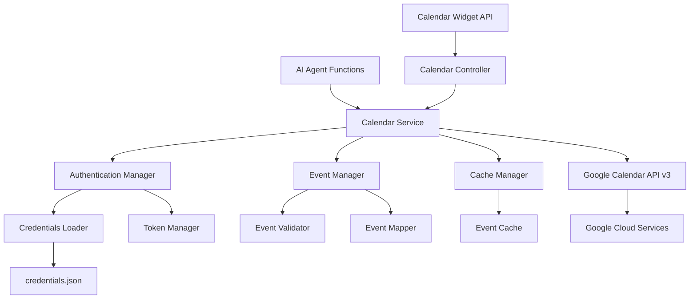

# Design Document: Google Calendar Integration

## Overview

The Google Calendar Integration provides comprehensive calendar management capabilities through Google Calendar API v3 integration using service account authentication. The system enables seamless calendar operations including event creation, retrieval, modification, and deletion, while supporting both AI agent function calling and direct API access for the dashboard calendar widget.

The design implements a service-oriented architecture with robust error handling, rate limiting, and caching mechanisms. Service account authentication eliminates the need for user OAuth flows, enabling automated calendar management through the AI agent while maintaining security and proper access controls.

## Architecture



The architecture separates concerns across multiple layers:

1. **API Layer**: REST controllers for frontend calendar widget access
2. **Service Layer**: Core calendar business logic and orchestration
3. **Integration Layer**: Google Calendar API client and authentication
4. **Caching Layer**: Event caching for performance optimization
5. **External Layer**: Google Calendar API and service account credentials

## Components and Interfaces

### Core Components

**CalendarService**
- Central service orchestrating all calendar operations
- Manages authentication, event operations, and error handling
- Provides both synchronous and asynchronous operation modes
- Integrates with caching layer for performance optimization

**CalendarController**
- REST controller providing `/api/calendar` endpoint for frontend
- Handles authentication validation and request/response formatting
- Manages HTTP status codes and error responses
- Supports query parameters for date ranges and event filtering

**AuthenticationManager**
- Manages service account authentication and token lifecycle
- Handles credential loading from filesystem
- Implements token refresh and validation logic
- Provides authentication context for API calls

**EventManager**
- Core event operation logic (CRUD operations)
- Handles event validation, mapping, and transformation
- Manages timezone conversions and date/time processing
- Implements conflict detection and resolution strategies

### Data Models

**CalendarEvent**
```java
public class CalendarEvent {
    private String id;
    private String title;
    private String description;
    private LocalDateTime startTime;
    private LocalDateTime endTime;
    private String location;
    private String timeZone;
    private Map<String, String> metadata;
    
    // Constructors, getters, setters
}
```

**EventRequest**
```java
public class EventRequest {
    private String title;
    private String description;
    private LocalDateTime dateTime;
    private Duration duration;
    private String location;
    private String timeZone;
}
```

**EventQueryRequest**
```java
public class EventQueryRequest {
    private LocalDate startDate;
    private LocalDate endDate;
    private Integer maxResults;
    private String timeZone;
    private List<String> calendarIds;
}
```

**CalendarResponse**
```java
public class CalendarResponse<T> {
    private T data;
    private boolean success;
    private String message;
    private Map<String, Object> metadata;
    private Instant timestamp;
}
```

### Authentication Configuration

**Service Account Setup**
```java
@Configuration
public class GoogleCalendarConfiguration {
    
    @Value("${google.calendar.credentials.path:/app/credentials.json}")
    private String credentialsPath;
    
    @Value("${google.calendar.application.name:Personal Dashboard}")
    private String applicationName;
    
    @Bean
    public GoogleCredentials googleCredentials() throws IOException {
        return GoogleCredentials.fromStream(
            new FileInputStream(credentialsPath)
        ).createScoped(CalendarScopes.CALENDAR);
    }
    
    @Bean
    public Calendar googleCalendar(GoogleCredentials credentials) throws IOException {
        NetHttpTransport httpTransport = GoogleNetHttpTransport.newTrustedTransport();
        JsonFactory jsonFactory = GsonFactory.getDefaultInstance();
        
        return new Calendar.Builder(httpTransport, jsonFactory, 
            new HttpCredentialsAdapter(credentials))
            .setApplicationName(applicationName)
            .build();
    }
}
```

### Event Operations

**Event Creation Flow**
1. Validate event request parameters and required fields
2. Convert request to Google Calendar Event object
3. Handle timezone conversion and date/time formatting
4. Execute API call with retry logic and error handling
5. Cache created event and return response with event ID

**Event Retrieval Flow**
1. Check cache for requested events within date range
2. If cache miss, query Google Calendar API with date filters
3. Transform API response to internal event model
4. Update cache with retrieved events and TTL
5. Return formatted event list with metadata

**Event Modification Flow**
1. Validate event exists and user has modification permissions
2. Merge update parameters with existing event data
3. Execute API update call with optimistic locking
4. Invalidate relevant cache entries
5. Return updated event details or error response

## Data Models

### Google Calendar API Integration

**API Client Configuration**
```properties
# Google Calendar Configuration
google.calendar.credentials.path=/app/credentials.json
google.calendar.application.name=Personal Agentic Dashboard
google.calendar.default.calendar.id=primary
google.calendar.api.timeout=30000
google.calendar.retry.max.attempts=3
google.calendar.retry.backoff.multiplier=2
```

**Rate Limiting and Quotas**
- Implement exponential backoff for rate limit exceeded errors
- Cache frequently accessed events to reduce API calls
- Batch operations when possible to optimize quota usage
- Monitor API usage and implement request throttling

**Error Handling Strategy**
- Distinguish between transient and permanent API errors
- Implement retry logic with exponential backoff for transient failures
- Provide user-friendly error messages for common failure scenarios
- Log detailed error information for debugging while preserving privacy

### Caching Strategy

**Event Cache Implementation**
```java
@Component
public class EventCacheManager {
    private final Cache<String, List<CalendarEvent>> eventCache;
    private final Cache<String, CalendarEvent> singleEventCache;
    
    @Value("${calendar.cache.ttl.minutes:15}")
    private int cacheTtlMinutes;
    
    public EventCacheManager() {
        this.eventCache = Caffeine.newBuilder()
            .maximumSize(1000)
            .expireAfterWrite(cacheTtlMinutes, TimeUnit.MINUTES)
            .build();
            
        this.singleEventCache = Caffeine.newBuilder()
            .maximumSize(5000)
            .expireAfterWrite(cacheTtlMinutes, TimeUnit.MINUTES)
            .build();
    }
}
```

**Cache Key Strategy**
- Date range queries: `events:{startDate}:{endDate}:{calendarId}`
- Single events: `event:{eventId}:{calendarId}`
- Cache invalidation on event modifications
- TTL-based expiration with configurable duration
## Correctness Properties

*A property is a characteristic or behavior that should hold true across all valid executions of a system—essentially, a formal statement about what the system should do. Properties serve as the bridge between human-readable specifications and machine-verifiable correctness guarantees.*

### Authentication and Security Properties

**Property 1: Service account authentication reliability**
*For any* valid service account credentials file, the Calendar_Service should successfully authenticate with Google Calendar API and establish secure connections
**Validates: Requirements 1.1, 1.3**

**Property 2: Credential validation consistency**
*For any* credentials file (valid or invalid format), the Calendar_Service should validate the file format and handle authentication errors gracefully with appropriate error messages
**Validates: Requirements 1.2, 1.4**

**Property 3: Automatic token management**
*For any* authentication session, the Calendar_Service should handle credential refresh and token management automatically without manual intervention
**Validates: Requirements 1.5**

### Event Retrieval Properties

**Property 4: Date range event retrieval**
*For any* specified date range, the Calendar_Service should retrieve all events within that range and return complete event information including title, start time, end time, description, and location
**Validates: Requirements 2.1, 2.2**

**Property 5: Empty result handling**
*For any* date range with no existing events, the Calendar_Service should return an empty result set without errors or exceptions
**Validates: Requirements 2.3**

**Property 6: Timezone conversion accuracy**
*For any* calendar event with timezone information, the Calendar_Service should handle timezone conversions appropriately for accurate event display
**Validates: Requirements 2.4**

**Property 7: Query rate limiting compliance**
*For any* sequence of event queries, the Calendar_Service should limit requests to prevent excessive API usage and respect Google Calendar API rate limits
**Validates: Requirements 2.5**

### Event Creation Properties

**Property 8: Event creation parameter acceptance**
*For any* valid event creation request with title, date/time, and duration parameters, the Calendar_Service should accept the parameters and create the event successfully
**Validates: Requirements 3.1**

**Property 9: Event data validation**
*For any* event creation request, the Calendar_Service should validate event data including date/time format, duration validity, and required fields before attempting creation
**Validates: Requirements 3.2**

**Property 10: Successful creation response**
*For any* successful event creation, the Calendar_Service should return the created event details including the generated event ID and all event metadata
**Validates: Requirements 3.3**

**Property 11: Creation failure error handling**
*For any* event creation failure, the Calendar_Service should provide specific error messages indicating the cause of failure without exposing sensitive API details
**Validates: Requirements 3.4**

**Property 12: Scheduling conflict management**
*For any* event creation that results in scheduling conflicts, the Calendar_Service should create the event and optionally provide warnings about overlaps
**Validates: Requirements 3.5**

### Event Management Properties

**Property 13: Event update reliability**
*For any* existing event and valid update parameters, the Calendar_Service should modify the event using the event ID and return updated event details
**Validates: Requirements 4.1**

**Property 14: Event deletion flexibility**
*For any* existing event, the Calendar_Service should successfully remove the event when identified by either event ID or by title and date combination
**Validates: Requirements 4.2**

**Property 15: Existence validation before operations**
*For any* event modification or deletion request, the Calendar_Service should validate that the target event exists before attempting the operation
**Validates: Requirements 4.3**

**Property 16: Operation error handling**
*For any* failed event operation (update/delete), the Calendar_Service should provide clear error messages without exposing sensitive API implementation details
**Validates: Requirements 4.4**

**Property 17: Concurrent modification safety**
*For any* concurrent event modification attempts, the Calendar_Service should handle them gracefully to prevent data corruption and maintain event integrity
**Validates: Requirements 4.5**

### API Integration Properties

**Property 18: Google Calendar API integration**
*For any* calendar operation, the Calendar_Service should successfully integrate with Google Calendar API v3 using the google-api-services-calendar library
**Validates: Requirements 5.1**

**Property 19: Rate limit handling with backoff**
*For any* API rate limit exceeded scenario, the Calendar_Service should implement exponential backoff and retry mechanisms to handle the rate limiting gracefully
**Validates: Requirements 5.2**

**Property 20: Network failure resilience**
*For any* network failure, timeout, or API unavailability, the Calendar_Service should handle the error condition with appropriate error responses and recovery mechanisms
**Validates: Requirements 5.3**

**Property 21: Response validation and error handling**
*For any* API response (valid or malformed), the Calendar_Service should validate the response format and handle unexpected responses gracefully
**Validates: Requirements 5.4**

**Property 22: Privacy-preserving API logging**
*For any* API interaction, the Calendar_Service should log appropriate debugging information while maintaining user privacy and not exposing sensitive data
**Validates: Requirements 5.5**

### Calendar Widget API Properties

**Property 23: Calendar endpoint functionality**
*For any* GET request to `/api/calendar`, the Calendar_Service should retrieve upcoming events and return them in a structured JSON format suitable for frontend consumption
**Validates: Requirements 6.1, 6.3**

**Property 24: Endpoint authentication and authorization**
*For any* calendar endpoint access, the Calendar_Service should require valid authentication and validate user permissions before providing calendar data
**Validates: Requirements 6.2**

**Property 25: Data unavailability error handling**
*For any* scenario where calendar data is unavailable, the Calendar_Service should return appropriate HTTP status codes and descriptive error messages
**Validates: Requirements 6.4**

**Property 26: Performance optimization through caching**
*For any* calendar data request, the Calendar_Service should cache data appropriately to reduce API calls and improve response performance
**Validates: Requirements 6.5**

### Configuration and Setup Properties

**Property 27: Configurable credential loading**
*For any* configured file path, the Calendar_Service should load Google service account credentials from the specified location and validate the credentials
**Validates: Requirements 7.1**

**Property 28: Graceful credential failure handling**
*For any* missing or invalid credentials scenario, the Calendar_Service should fail gracefully with clear setup instructions and actionable error messages
**Validates: Requirements 7.2**

**Property 29: Application properties configuration**
*For any* application properties configuration, the Calendar_Service should support configuration of default calendar ID and API settings and apply them correctly
**Validates: Requirements 7.3**

**Property 30: Startup validation and health checks**
*For any* application startup, the Calendar_Service should validate calendar access permissions and provide health check endpoints to verify Google Calendar API connectivity
**Validates: Requirements 7.4, 7.5**

## Error Handling

### Authentication Errors

**Credential Loading Failures**
- Validate credentials file exists and is readable
- Check JSON format and required service account fields
- Provide clear error messages for missing or malformed credentials
- Implement fallback mechanisms for credential loading issues

**API Authentication Failures**
- Handle invalid service account credentials gracefully
- Implement token refresh logic with exponential backoff
- Manage OAuth 2.0 flow errors and scope permission issues
- Log authentication failures for monitoring without exposing secrets

### API Operation Errors

**Rate Limiting and Quotas**
- Implement exponential backoff starting at 1 second intervals
- Queue non-urgent operations during rate limit periods
- Monitor API usage patterns to prevent quota exhaustion
- Provide user feedback for delayed operations due to rate limits

**Network and Connectivity Issues**
- Handle connection timeouts with configurable retry attempts
- Implement circuit breaker pattern for persistent API failures
- Provide offline mode capabilities where possible
- Cache recent data for graceful degradation during outages

**Data Validation Errors**
- Validate event data before API calls to prevent unnecessary requests
- Handle timezone conversion errors and invalid date formats
- Provide specific validation error messages for user correction
- Implement data sanitization to prevent API rejection

### Caching and Performance

**Cache Management**
- Implement TTL-based cache expiration with configurable durations
- Handle cache invalidation on event modifications
- Provide cache warming strategies for frequently accessed data
- Monitor cache hit rates and adjust strategies accordingly

**Memory and Resource Management**
- Implement cache size limits to prevent memory exhaustion
- Use weak references for large cached objects
- Provide cache cleanup mechanisms for expired entries
- Monitor memory usage and implement garbage collection strategies

## Testing Strategy

### Dual Testing Approach

The Google Calendar Integration requires comprehensive testing combining unit tests and property-based tests:

**Unit Tests** verify specific scenarios and integration points:
- Specific calendar operations with known event data
- Authentication flows with mock credentials and API responses
- Error handling for specific API failure scenarios
- Cache behavior with known data sets and expiration scenarios
- Configuration loading with various property combinations

**Property Tests** verify universal behaviors across all inputs:
- Calendar operations consistency across all event types and date ranges
- Authentication and credential handling across all credential formats
- Error handling consistency across all failure scenarios
- Caching behavior across all data patterns and access frequencies
- API integration reliability across all operation types and parameters

### Property-Based Testing Configuration

**Testing Framework**: Use JUnit 5 with jqwik for property-based testing
- Minimum 100 iterations per property test for comprehensive coverage
- Each property test references its design document property
- Tag format: **Feature: google-calendar-integration, Property {number}: {property_text}**

**Test Data Generation**:
- Generate random event data with various date ranges, timezones, and content
- Create different credential file formats (valid, invalid, malformed)
- Generate various API response scenarios (success, failure, malformed)
- Simulate network conditions and rate limiting scenarios
- Create edge cases for date/time handling and timezone conversions

**Integration Testing**:
- Test complete calendar flows with real Google Calendar API (using test accounts)
- Verify service account authentication with actual credentials
- Test caching behavior with real API responses and timing
- Validate error handling with actual API error responses
- Test concurrent operations with multiple simultaneous requests

**Mock and Stub Strategy**:
- Mock Google Calendar API for predictable testing scenarios
- Stub credential loading for various file system conditions
- Use real API integration for end-to-end validation
- Implement test doubles for network failure simulation
- Create mock responses for rate limiting and error scenario testing