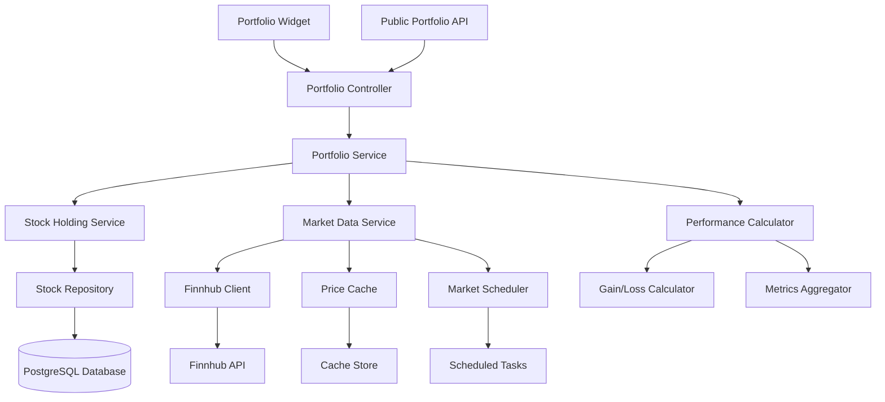

# Design Document: Portfolio Dashboard

## Overview

The Portfolio Dashboard provides comprehensive financial portfolio tracking and visualization through real-time market data integration with Finnhub API. The system enables users to monitor stock holdings, track performance metrics, and view portfolio analytics through both dashboard widgets and public API access. The design emphasizes data accuracy, performance optimization through intelligent caching, and robust error handling for financial data reliability.

The system implements a service-oriented architecture with clear separation between portfolio management, market data integration, performance calculations, and presentation layers. Real-time price updates are balanced with API quota management through strategic caching and market-hours-aware update scheduling.

## Architecture



The architecture separates concerns across multiple layers:

1. **Presentation Layer**: REST controllers and dashboard widgets for portfolio display
2. **Service Layer**: Business logic for portfolio management and performance calculations
3. **Integration Layer**: External API clients and market data management
4. **Caching Layer**: Price data caching for performance optimization
5. **Data Layer**: Stock holdings persistence and historical tracking
6. **Scheduling Layer**: Market-hours-aware data update scheduling

## Components and Interfaces

### Core Services

**PortfolioService**
- Central orchestration service for all portfolio operations
- Coordinates between holdings management, market data, and performance calculations
- Provides unified portfolio views and summary statistics
- Manages portfolio-level operations and cross-stock calculations

**StockHoldingService**
- Manages individual stock holdings CRUD operations
- Handles portfolio composition changes and validation
- Tracks historical changes and maintains audit trails
- Provides stock-level operations and filtering capabilities

**MarketDataService**
- Integrates with Finnhub API for real-time price data
- Manages price caching and update scheduling
- Handles market hours detection and update frequency optimization
- Provides price history and market status information

**PerformanceCalculator**
- Computes portfolio and individual stock performance metrics
- Calculates gains, losses, and percentage changes
- Handles complex scenarios like stock splits and dividends
- Provides aggregated portfolio statistics and analytics

### Data Models

**StockTicker Entity**
```java
@Entity
@Table(name = "stock_ticker")
public class StockTicker {
    @Id
    private String symbol;
    
    @Column(name = "shares_owned", nullable = false)
    private BigDecimal sharesOwned;
    
    @Column(name = "purchase_price")
    private BigDecimal purchasePrice;
    
    @Column(name = "average_cost")
    private BigDecimal averageCost;
    
    @Column(name = "purchase_date")
    private LocalDate purchaseDate;
    
    @Column(name = "last_updated")
    private LocalDateTime lastUpdated;
    
    // Constructors, getters, setters
}
```

**MarketData Model**
```java
public class MarketData {
    private String symbol;
    private BigDecimal currentPrice;
    private BigDecimal previousClose;
    private BigDecimal dailyChange;
    private BigDecimal dailyChangePercent;
    private BigDecimal high;
    private BigDecimal low;
    private Long volume;
    private LocalDateTime timestamp;
    private String marketStatus;
    
    // Constructors, getters, setters
}
```

**PortfolioSummary Model**
```java
public class PortfolioSummary {
    private BigDecimal totalValue;
    private BigDecimal totalCost;
    private BigDecimal totalGainLoss;
    private BigDecimal totalGainLossPercent;
    private BigDecimal dailyChange;
    private BigDecimal dailyChangePercent;
    private Integer totalPositions;
    private LocalDateTime lastUpdated;
    private List<StockPerformance> holdings;
    
    // Constructors, getters, setters
}
```

**StockPerformance Model**
```java
public class StockPerformance {
    private String symbol;
    private BigDecimal sharesOwned;
    private BigDecimal currentPrice;
    private BigDecimal purchasePrice;
    private BigDecimal currentValue;
    private BigDecimal totalCost;
    private BigDecimal gainLoss;
    private BigDecimal gainLossPercent;
    private BigDecimal dailyChange;
    private BigDecimal dailyChangePercent;
    private LocalDateTime priceTimestamp;
    
    // Constructors, getters, setters
}
```

### External API Integration

**Finnhub Client Configuration**
```java
@Component
public class FinnhubClient {
    
    @Value("${finnhub.api.key}")
    private String apiKey;
    
    @Value("${finnhub.api.base.url:https://finnhub.io/api/v1}")
    private String baseUrl;
    
    @Value("${finnhub.api.timeout:10000}")
    private int timeoutMs;
    
    private final RestTemplate restTemplate;
    
    public MarketData getQuote(String symbol) {
        String url = baseUrl + "/quote?symbol=" + symbol + "&token=" + apiKey;
        // Implementation with error handling and response mapping
    }
    
    public List<MarketData> getBatchQuotes(List<String> symbols) {
        // Batch API call implementation for multiple symbols
    }
}
```

**Finnhub Response Models**
```java
public class FinnhubQuoteResponse {
    @JsonProperty("c")
    private BigDecimal currentPrice;
    
    @JsonProperty("pc")
    private BigDecimal previousClose;
    
    @JsonProperty("h")
    private BigDecimal high;
    
    @JsonProperty("l")
    private BigDecimal low;
    
    @JsonProperty("o")
    private BigDecimal open;
    
    @JsonProperty("t")
    private Long timestamp;
    
    // Getters and setters
}
```

## Data Models

### Performance Calculation Engine

**Gain/Loss Calculator**
```java
@Component
public class GainLossCalculator {
    
    public StockPerformance calculateStockPerformance(StockTicker holding, MarketData marketData) {
        BigDecimal currentValue = holding.getSharesOwned().multiply(marketData.getCurrentPrice());
        BigDecimal totalCost = holding.getSharesOwned().multiply(holding.getPurchasePrice());
        BigDecimal gainLoss = currentValue.subtract(totalCost);
        BigDecimal gainLossPercent = gainLoss.divide(totalCost, 4, RoundingMode.HALF_UP)
            .multiply(BigDecimal.valueOf(100));
        
        return StockPerformance.builder()
            .symbol(holding.getSymbol())
            .sharesOwned(holding.getSharesOwned())
            .currentPrice(marketData.getCurrentPrice())
            .purchasePrice(holding.getPurchasePrice())
            .currentValue(currentValue)
            .totalCost(totalCost)
            .gainLoss(gainLoss)
            .gainLossPercent(gainLossPercent)
            .dailyChange(marketData.getDailyChange())
            .dailyChangePercent(marketData.getDailyChangePercent())
            .priceTimestamp(marketData.getTimestamp())
            .build();
    }
    
    public PortfolioSummary calculatePortfolioSummary(List<StockPerformance> holdings) {
        // Aggregate calculations for total portfolio performance
    }
}
```

### Caching Strategy

**Price Cache Implementation**
```java
@Component
public class PriceCacheManager {
    
    private final Cache<String, MarketData> priceCache;
    private final Cache<String, LocalDateTime> lastUpdateCache;
    
    @Value("${portfolio.cache.ttl.minutes:5}")
    private int cacheTtlMinutes;
    
    @Value("${portfolio.cache.market.hours.ttl.minutes:1}")
    private int marketHoursTtlMinutes;
    
    public PriceCacheManager() {
        this.priceCache = Caffeine.newBuilder()
            .maximumSize(1000)
            .expireAfterWrite(cacheTtlMinutes, TimeUnit.MINUTES)
            .build();
            
        this.lastUpdateCache = Caffeine.newBuilder()
            .maximumSize(1000)
            .expireAfterWrite(1, TimeUnit.HOURS)
            .build();
    }
    
    public Optional<MarketData> getCachedPrice(String symbol) {
        MarketData cached = priceCache.getIfPresent(symbol);
        if (cached != null && isDataFresh(symbol, cached)) {
            return Optional.of(cached);
        }
        return Optional.empty();
    }
    
    private boolean isDataFresh(String symbol, MarketData data) {
        // Check if data is fresh based on market hours and update frequency
        return MarketHoursUtil.isMarketOpen() ? 
            data.getTimestamp().isAfter(LocalDateTime.now().minusMinutes(marketHoursTtlMinutes)) :
            data.getTimestamp().isAfter(LocalDateTime.now().minusMinutes(cacheTtlMinutes));
    }
}
```

### Market Hours and Scheduling

**Market Hours Utility**
```java
@Component
public class MarketHoursUtil {
    
    private static final LocalTime MARKET_OPEN = LocalTime.of(9, 30);
    private static final LocalTime MARKET_CLOSE = LocalTime.of(16, 0);
    private static final ZoneId MARKET_TIMEZONE = ZoneId.of("America/New_York");
    
    public static boolean isMarketOpen() {
        ZonedDateTime now = ZonedDateTime.now(MARKET_TIMEZONE);
        DayOfWeek dayOfWeek = now.getDayOfWeek();
        
        // Check if it's a weekday
        if (dayOfWeek == DayOfWeek.SATURDAY || dayOfWeek == DayOfWeek.SUNDAY) {
            return false;
        }
        
        LocalTime currentTime = now.toLocalTime();
        return currentTime.isAfter(MARKET_OPEN) && currentTime.isBefore(MARKET_CLOSE);
    }
    
    public static Duration getTimeUntilMarketOpen() {
        // Calculate time until next market open
    }
    
    public static boolean isMarketHoliday(LocalDate date) {
        // Check against market holiday calendar
    }
}
```

**Scheduled Price Updates**
```java
@Component
public class PortfolioUpdateScheduler {
    
    private final MarketDataService marketDataService;
    private final PortfolioService portfolioService;
    
    @Scheduled(fixedRate = 60000) // Every minute during market hours
    @ConditionalOnExpression("#{marketHoursUtil.isMarketOpen()}")
    public void updateMarketHoursPrices() {
        List<String> symbols = portfolioService.getAllHoldingSymbols();
        marketDataService.updatePricesForSymbols(symbols);
    }
    
    @Scheduled(fixedRate = 900000) // Every 15 minutes after market close
    @ConditionalOnExpression("#{!marketHoursUtil.isMarketOpen()}")
    public void updateAfterHoursPrices() {
        List<String> symbols = portfolioService.getAllHoldingSymbols();
        marketDataService.updatePricesForSymbols(symbols);
    }
}
```

### Database Schema Design

**Stock Ticker Table**
```sql
CREATE TABLE stock_ticker (
    symbol VARCHAR(10) PRIMARY KEY,
    shares_owned DECIMAL(15,6) NOT NULL CHECK (shares_owned > 0),
    purchase_price DECIMAL(10,2) CHECK (purchase_price > 0),
    average_cost DECIMAL(10,2),
    purchase_date DATE,
    last_updated TIMESTAMP DEFAULT CURRENT_TIMESTAMP ON UPDATE CURRENT_TIMESTAMP,
    created_at TIMESTAMP DEFAULT CURRENT_TIMESTAMP
);

CREATE INDEX idx_stock_ticker_symbol ON stock_ticker(symbol);
CREATE INDEX idx_stock_ticker_updated ON stock_ticker(last_updated);
```

### Configuration Properties

**Application Configuration**
```properties
# Finnhub API Configuration
finnhub.api.key=${FINNHUB_KEY}
finnhub.api.base.url=https://finnhub.io/api/v1
finnhub.api.timeout=10000
finnhub.api.retry.max.attempts=3
finnhub.api.retry.backoff.multiplier=2

# Portfolio Cache Configuration
portfolio.cache.ttl.minutes=5
portfolio.cache.market.hours.ttl.minutes=1
portfolio.cache.max.size=1000

# Market Hours Configuration
portfolio.market.timezone=America/New_York
portfolio.market.open.time=09:30
portfolio.market.close.time=16:00

# Update Scheduling
portfolio.update.market.hours.interval=60000
portfolio.update.after.hours.interval=900000
```
## Correctness Properties

*A property is a characteristic or behavior that should hold true across all valid executions of a system—essentially, a formal statement about what the system should do. Properties serve as the bridge between human-readable specifications and machine-verifiable correctness guarantees.*

### Stock Holdings Management Properties

**Property 1: Stock holding storage completeness**
*For any* valid stock holding with ticker symbol, shares owned, and purchase price, the Portfolio_Dashboard should store all required information with proper data validation and constraints
**Validates: Requirements 1.1**

**Property 2: Stock holding validation consistency**
*For any* stock holding creation or update request, the Portfolio_Dashboard should validate ticker symbol format and ensure shares and price are positive numbers before storage
**Validates: Requirements 1.2**

**Property 3: Stock holding update reliability**
*For any* existing stock holding and valid update parameters, the Portfolio_Dashboard should successfully update shares owned and average purchase price with proper validation
**Validates: Requirements 1.3**

**Property 4: Automatic performance recalculation**
*For any* stock holding modification, the Portfolio_Dashboard should automatically recalculate portfolio performance metrics and update all dependent calculations
**Validates: Requirements 1.4**

**Property 5: Historical tracking persistence**
*For any* portfolio change or stock holding modification, the Portfolio_Dashboard should maintain historical records for tracking and audit purposes
**Validates: Requirements 1.5**

### Market Data Integration Properties

**Property 6: Finnhub API integration reliability**
*For any* stock symbol in the portfolio, the Portfolio_Dashboard should successfully integrate with Finnhub API to fetch real-time stock prices and market data
**Validates: Requirements 2.1**

**Property 7: API rate limit compliance**
*For any* sequence of market data requests, the Portfolio_Dashboard should handle API rate limits and quota restrictions appropriately without causing system failures
**Validates: Requirements 2.2**

**Property 8: Price data caching optimization**
*For any* stock price request, the Portfolio_Dashboard should cache the data appropriately to reduce API calls and improve system performance while maintaining data freshness
**Validates: Requirements 2.3**

**Property 9: Graceful data unavailability handling**
*For any* scenario where market data is unavailable, the Portfolio_Dashboard should display the last known prices with appropriate timestamps and freshness indicators
**Validates: Requirements 2.4**

**Property 10: Market-hours-aware update scheduling**
*For any* market period (open or closed), the Portfolio_Dashboard should update market data at appropriate configurable intervals based on market status
**Validates: Requirements 2.5**

### Portfolio Performance Calculation Properties

**Property 11: Portfolio value calculation accuracy**
*For any* portfolio composition with current market prices, the Portfolio_Dashboard should compute total portfolio value based on real-time prices and share quantities with mathematical precision
**Validates: Requirements 3.1**

**Property 12: Individual stock gain/loss calculation**
*For any* stock holding with current and purchase prices, the Portfolio_Dashboard should calculate gains and losses using the formula (current price - purchase price) × shares owned
**Validates: Requirements 3.2**

**Property 13: Daily change calculation and display**
*For any* stock holding with price history, the Portfolio_Dashboard should display daily price changes and percentage changes with proper formatting and accuracy
**Validates: Requirements 3.3**

**Property 14: Portfolio aggregation accuracy**
*For any* portfolio with multiple holdings, the Portfolio_Dashboard should compute total portfolio gain/loss as the mathematically correct sum of all individual stock performances
**Validates: Requirements 3.4**

**Property 15: Edge case handling robustness**
*For any* edge case scenario (stock splits, dividends, delisted stocks), the Portfolio_Dashboard should handle the situation appropriately without corrupting portfolio calculations
**Validates: Requirements 3.5**

### Dashboard Display and Visualization Properties

**Property 16: Portfolio summary widget completeness**
*For any* portfolio state, the Portfolio_Dashboard should display a summary widget showing total value, daily change, and overall gain/loss with proper formatting
**Validates: Requirements 4.1**

**Property 17: Individual stock display completeness**
*For any* stock holding, the Portfolio_Dashboard should display ticker symbol, current price, daily change, and total gain/loss with all required information visible
**Validates: Requirements 4.2**

**Property 18: Visual performance indicators**
*For any* stock or portfolio performance state (positive or negative), the Portfolio_Dashboard should use appropriate visual indicators (colors, icons) to represent the performance
**Validates: Requirements 4.3**

**Property 19: Financial data formatting consistency**
*For any* financial value displayed, the Portfolio_Dashboard should format the data with proper currency symbols and decimal precision according to financial display standards
**Validates: Requirements 4.4**

**Property 20: Automatic display updates**
*For any* new market data availability, the Portfolio_Dashboard should update the display automatically to reflect the latest information without manual refresh
**Validates: Requirements 4.5**

### Public Portfolio API Properties

**Property 21: Portfolio API endpoint functionality**
*For any* GET request to `/api/portfolio`, the Portfolio_Dashboard should return current portfolio data in structured JSON format suitable for frontend consumption
**Validates: Requirements 5.1, 5.3**

**Property 22: API response data completeness**
*For any* portfolio API request, the Portfolio_Dashboard should return current holdings with real-time market data and all necessary portfolio information
**Validates: Requirements 5.2**

**Property 23: API error handling consistency**
*For any* scenario where portfolio data is unavailable, the Portfolio_Dashboard should return appropriate HTTP status codes and descriptive error messages
**Validates: Requirements 5.4**

**Property 24: API parameter support flexibility**
*For any* API request with parameters, the Portfolio_Dashboard should support both summary and detailed portfolio views based on the provided parameters
**Validates: Requirements 5.5**

### Error Handling and Reliability Properties

**Property 25: API failure retry mechanism**
*For any* external API call failure, the Portfolio_Dashboard should implement retry logic with exponential backoff to handle transient failures appropriately
**Validates: Requirements 6.1**

**Property 26: Network failure graceful degradation**
*For any* network failure or API unavailability scenario, the Portfolio_Dashboard should handle the situation with graceful degradation and maintain system functionality
**Validates: Requirements 6.2**

**Property 27: Data freshness indication**
*For any* stock price data that is stale or unavailable, the Portfolio_Dashboard should clearly indicate data freshness and timestamp information to users
**Validates: Requirements 6.3**

**Property 28: Financial calculation validation**
*For any* financial calculation involving edge cases (zero or negative prices), the Portfolio_Dashboard should validate inputs and handle edge cases appropriately
**Validates: Requirements 6.4**

**Property 29: Financial error logging**
*For any* financial data error or calculation failure, the Portfolio_Dashboard should log the error appropriately for monitoring and debugging purposes
**Validates: Requirements 6.5**

### Configuration and Market Hours Properties

**Property 30: Configuration flexibility**
*For any* configuration setting (API keys, endpoints, cache TTL, update intervals), the Portfolio_Dashboard should support configurable options and apply them correctly
**Validates: Requirements 7.1, 7.4**

**Property 31: Market-hours-aware frequency adjustment**
*For any* market status (open or closed), the Portfolio_Dashboard should adjust update frequency appropriately to conserve API quota during closed periods
**Validates: Requirements 7.2**

**Property 32: International market hours support**
*For any* international stock or exchange, the Portfolio_Dashboard should respect the appropriate market hours and trading schedules for that specific market
**Validates: Requirements 7.3**

**Property 33: Health check connectivity verification**
*For any* health check request, the Portfolio_Dashboard should verify financial API connectivity and report the status accurately for monitoring purposes
**Validates: Requirements 7.5**

## Error Handling

### Market Data API Errors

**Finnhub API Integration Failures**
- Handle authentication errors with clear error messages and configuration guidance
- Implement exponential backoff for rate limit exceeded scenarios (1s, 2s, 4s, 8s intervals)
- Manage network timeouts and connection failures with retry mechanisms
- Process malformed API responses and missing data gracefully

**Data Quality and Validation**
- Validate stock symbols against known formats and exchanges
- Handle missing or null price data from external APIs
- Detect and handle anomalous price data (extreme values, negative prices)
- Manage currency conversion and international stock data formatting

### Financial Calculation Errors

**Mathematical Precision and Edge Cases**
- Use BigDecimal for all financial calculations to ensure precision
- Handle division by zero scenarios in percentage calculations
- Manage stock splits and dividend adjustments in historical data
- Process delisted stocks and suspended trading scenarios

**Portfolio Aggregation Errors**
- Handle empty portfolios and zero-value holdings appropriately
- Manage mixed currency portfolios with proper conversion
- Process partial data scenarios when some stock prices are unavailable
- Ensure calculation consistency across different portfolio sizes

### Caching and Performance Errors

**Cache Management Issues**
- Handle cache invalidation failures and stale data scenarios
- Manage cache size limits and memory constraints
- Process cache miss scenarios during high-load periods
- Implement cache warming strategies for frequently accessed data

**Scheduling and Update Errors**
- Handle scheduler failures and missed update cycles
- Manage market holiday detection and schedule adjustments
- Process timezone conversion errors for international markets
- Ensure update frequency compliance with API rate limits

### Display and Formatting Errors

**Data Presentation Issues**
- Handle null or missing data in display components
- Manage number formatting for different locales and currencies
- Process color and visual indicator rendering failures
- Ensure responsive display updates during data refresh cycles

**API Response Formatting**
- Validate JSON structure and required fields in API responses
- Handle serialization errors for complex financial objects
- Manage API versioning and backward compatibility
- Process concurrent request scenarios and data consistency

## Testing Strategy

### Dual Testing Approach

The Portfolio Dashboard requires comprehensive testing combining unit tests and property-based tests:

**Unit Tests** verify specific scenarios and integration points:
- Specific portfolio calculations with known stock prices and holdings
- Market data API integration with mock responses and error scenarios
- Caching behavior with known access patterns and expiration scenarios
- Display formatting with specific financial values and edge cases
- Scheduling behavior with mock market hours and time scenarios

**Property Tests** verify universal behaviors across all inputs:
- Portfolio calculations consistency across all stock combinations and price ranges
- Market data integration reliability across all API response scenarios
- Caching behavior across all access patterns and data freshness scenarios
- Error handling consistency across all failure modes and edge cases
- Display and formatting accuracy across all financial value ranges and formats

### Property-Based Testing Configuration

**Testing Framework**: Use JUnit 5 with jqwik for property-based testing
- Minimum 100 iterations per property test for comprehensive coverage
- Each property test references its design document property
- Tag format: **Feature: portfolio-dashboard, Property {number}: {property_text}**

**Test Data Generation**:
- Generate random stock portfolios with various symbols, quantities, and prices
- Create different market data scenarios (normal, extreme, missing, stale data)
- Generate various API response scenarios (success, failure, rate limits, malformed)
- Simulate different market conditions (open, closed, holidays, international)
- Create edge cases for financial calculations (zero values, negative prices, large numbers)

**Integration Testing**:
- Test complete portfolio workflows from data input to display output
- Verify real Finnhub API integration with test API keys and sandbox data
- Test caching behavior with real cache implementations and timing
- Validate scheduling behavior with actual time-based scenarios
- Test concurrent operations with multiple simultaneous portfolio updates

**Mock and Stub Strategy**:
- Mock Finnhub API for predictable testing scenarios
- Stub market hours utilities for controlled time-based testing
- Use real integrations for end-to-end validation
- Implement test doubles for network failure simulation
- Create mock responses for various market data scenarios and edge cases