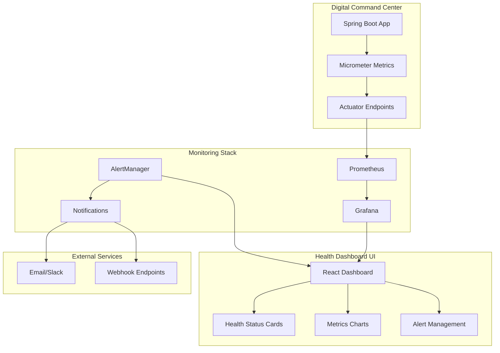

# Design Document: Service Health Dashboard

## Overview

The Service Health Dashboard is a comprehensive monitoring solution built on proven open-source technologies including Prometheus, Grafana, and Spring Boot Actuator. The system provides real-time visibility into service health, performance metrics, throttling statistics, and cache performance through a modern, responsive web interface.

## Architecture

### High-Level Architecture



### Technology Stack

**Backend Monitoring:**
- **Prometheus**: Time-series database for metrics collection and storage
- **Grafana**: Visualization and dashboarding platform
- **AlertManager**: Alert routing and notification management
- **Spring Boot Actuator**: Application metrics and health endpoints
- **Micrometer**: Metrics collection library with Prometheus integration

**Frontend Dashboard:**
- **React 18**: Modern UI framework for dashboard interface
- **TypeScript**: Type-safe development
- **Tailwind CSS**: Utility-first CSS framework
- **Recharts**: Chart library for metrics visualization
- **React Query**: Data fetching and caching

**Infrastructure:**
- **Docker Compose**: Container orchestration for monitoring stack
- **Nginx**: Reverse proxy and load balancing
- **PostgreSQL**: Metrics metadata storage (optional)

## Components and Interfaces

### 1. Metrics Collection Layer

**Spring Boot Actuator Configuration:**
```java
@Configuration
@EnableConfigurationProperties(MonitoringProperties.class)
public class MonitoringConfig {
    
    @Bean
    public MeterRegistry meterRegistry() {
        return new PrometheusMeterRegistry(PrometheusConfig.DEFAULT);
    }
    
    @Bean
    public TimedAspect timedAspect(MeterRegistry registry) {
        return new TimedAspect(registry);
    }
}
```

**Custom Metrics Service:**
```java
@Service
public class MetricsService {
    private final MeterRegistry meterRegistry;
    private final Counter throttledRequests;
    private final Timer responseTime;
    private final Gauge cacheHitRatio;
    
    public void recordThrottledRequest(String endpoint) {
        throttledRequests.increment(Tags.of("endpoint", endpoint));
    }
    
    public void recordCacheHit(String cacheType, boolean hit) {
        // Cache hit ratio tracking
    }
    
    public void recordResponseTime(String endpoint, Duration duration) {
        responseTime.record(duration, Tags.of("endpoint", endpoint));
    }
}
```

### 2. Health Check System

**Health Check Service:**
```java
@Component
public class ServiceHealthChecker {
    
    @Scheduled(fixedRate = 30000) // Every 30 seconds
    public void performHealthChecks() {
        checkLifeLogService();
        checkDigitalGardenService();
        checkLifeSignalsService();
        checkExternalAPIs();
    }
    
    private HealthStatus checkLifeLogService() {
        // Perform health check logic
        return HealthStatus.UP;
    }
}
```

**Health Status Indicator:**
```java
@Component
public class CustomHealthIndicator implements HealthIndicator {
    
    @Override
    public Health health() {
        return Health.up()
            .withDetail("service", "life-log")
            .withDetail("responseTime", "45ms")
            .withDetail("lastCheck", Instant.now())
            .build();
    }
}
```

### 3. Dashboard Frontend Components

**Health Status Dashboard:**
```typescript
interface HealthMetrics {
  serviceName: string;
  status: 'healthy' | 'degraded' | 'down';
  responseTime: number;
  uptime: number;
  errorRate: number;
  lastCheck: string;
}

const HealthStatusCard: React.FC<{ metrics: HealthMetrics }> = ({ metrics }) => {
  const statusColor = {
    healthy: 'bg-green-500',
    degraded: 'bg-yellow-500',
    down: 'bg-red-500'
  }[metrics.status];
  
  return (
    <div className="bg-white rounded-lg shadow p-6">
      <div className="flex items-center justify-between">
        <h3 className="text-lg font-semibold">{metrics.serviceName}</h3>
        <div className={`w-4 h-4 rounded-full ${statusColor}`} />
      </div>
      {/* Metrics display */}
    </div>
  );
};
```

**Metrics Charts Component:**
```typescript
const MetricsChart: React.FC<{ data: MetricData[], type: ChartType }> = ({ data, type }) => {
  return (
    <ResponsiveContainer width="100%" height={300}>
      <LineChart data={data}>
        <CartesianGrid strokeDasharray="3 3" />
        <XAxis dataKey="timestamp" />
        <YAxis />
        <Tooltip />
        <Line type="monotone" dataKey="value" stroke="#8884d8" />
      </LineChart>
    </ResponsiveContainer>
  );
};
```

### 4. Prometheus Configuration

**Prometheus Configuration (prometheus.yml):**
```yaml
global:
  scrape_interval: 15s
  evaluation_interval: 15s

rule_files:
  - "alert_rules.yml"

scrape_configs:
  - job_name: 'digital-command-center'
    static_configs:
      - targets: ['app:8080']
    metrics_path: '/actuator/prometheus'
    scrape_interval: 15s

alerting:
  alertmanagers:
    - static_configs:
        - targets:
          - alertmanager:9093
```

**Alert Rules (alert_rules.yml):**
```yaml
groups:
  - name: service_health
    rules:
      - alert: HighErrorRate
        expr: rate(http_requests_total{status=~"5.."}[5m]) > 0.01
        for: 2m
        labels:
          severity: critical
        annotations:
          summary: "High error rate detected"
          
      - alert: HighResponseTime
        expr: histogram_quantile(0.95, rate(http_request_duration_seconds_bucket[5m])) > 2
        for: 5m
        labels:
          severity: warning
        annotations:
          summary: "High response time detected"
          
      - alert: LowCacheHitRatio
        expr: cache_hit_ratio < 0.8
        for: 10m
        labels:
          severity: warning
        annotations:
          summary: "Cache hit ratio below threshold"
```

### 5. Grafana Dashboard Configuration

**Dashboard JSON Configuration:**
```json
{
  "dashboard": {
    "title": "Service Health Dashboard",
    "panels": [
      {
        "title": "Service Health Status",
        "type": "stat",
        "targets": [
          {
            "expr": "up{job=\"digital-command-center\"}",
            "legendFormat": "{{instance}}"
          }
        ]
      },
      {
        "title": "Response Time Percentiles",
        "type": "graph",
        "targets": [
          {
            "expr": "histogram_quantile(0.50, rate(http_request_duration_seconds_bucket[5m]))",
            "legendFormat": "p50"
          },
          {
            "expr": "histogram_quantile(0.95, rate(http_request_duration_seconds_bucket[5m]))",
            "legendFormat": "p95"
          }
        ]
      }
    ]
  }
}
```

## Data Models

### Health Status Model
```typescript
interface ServiceHealth {
  serviceName: string;
  status: HealthStatus;
  responseTime: number;
  uptime: number;
  errorRate: number;
  lastCheck: Date;
  details: Record<string, any>;
}

enum HealthStatus {
  HEALTHY = 'healthy',
  DEGRADED = 'degraded',
  DOWN = 'down'
}
```

### Metrics Model
```typescript
interface MetricPoint {
  timestamp: Date;
  value: number;
  labels: Record<string, string>;
}

interface ThrottlingMetrics {
  endpoint: string;
  requestsThrottled: number;
  throttlingRate: number;
  timeWindow: string;
}

interface CacheMetrics {
  cacheType: string;
  hitRatio: number;
  hits: number;
  misses: number;
  timeWindow: string;
}
```

## Correctness Properties

*A property is a characteristic or behavior that should hold true across all valid executions of a system-essentially, a formal statement about what the system should do. Properties serve as the bridge between human-readable specifications and machine-verifiable correctness guarantees.*

### Property 1: Health Status Consistency
*For any* service health check, the reported status should accurately reflect the actual service state based on response time and error rate thresholds.
**Validates: Requirements 1.2, 1.4**

### Property 2: Metrics Collection Completeness
*For any* API request processed by the system, corresponding metrics should be recorded for response time, status code, and endpoint identification.
**Validates: Requirements 4.1, 4.2**

### Property 3: Throttling Metrics Accuracy
*For any* throttled request, the throttling metrics should accurately increment counters and calculate rates within the specified time windows.
**Validates: Requirements 2.1, 2.3**

### Property 4: Cache Hit Ratio Calculation
*For any* cache operation (hit or miss), the cache hit ratio should be calculated correctly as hits divided by total operations over the specified time window.
**Validates: Requirements 3.1, 3.3**

### Property 5: Alert Threshold Compliance
*For any* metric that exceeds configured alert thresholds, an alert should be generated within the specified time window and delivered to configured notification channels.
**Validates: Requirements 8.2, 8.3**

### Property 6: Historical Data Retention
*For any* metrics data point collected, it should be retained for the configured retention period and be accessible for historical analysis and reporting.
**Validates: Requirements 9.1, 9.4**

## Error Handling

### Monitoring Stack Failures
- **Prometheus Unavailable**: Dashboard displays cached metrics with staleness indicators
- **Grafana Connection Issues**: Fallback to embedded charts in React dashboard
- **AlertManager Failures**: Direct notification fallback through application alerts

### Application Metrics Failures
- **Metrics Collection Errors**: Log errors but continue application operation
- **Health Check Timeouts**: Mark service as degraded with timeout indication
- **External Service Monitoring**: Graceful degradation with cached status

### Dashboard Error States
- **API Connection Failures**: Display connection status and retry mechanisms
- **Chart Rendering Errors**: Fallback to tabular data display
- **Real-time Update Failures**: Manual refresh options and error notifications

## Testing Strategy

### Unit Testing
- **Metrics Collection**: Test custom metrics recording and aggregation
- **Health Check Logic**: Verify health status determination algorithms
- **Alert Rule Evaluation**: Test threshold calculations and alert generation
- **Dashboard Components**: Test React component rendering and interactions

### Integration Testing
- **Prometheus Integration**: Verify metrics scraping and storage
- **Grafana Dashboard**: Test dashboard configuration and data visualization
- **AlertManager Integration**: Test alert routing and notification delivery
- **End-to-End Monitoring**: Test complete monitoring pipeline from metrics to alerts

### Property-Based Testing
- **Metrics Accuracy**: Generate random request patterns and verify metric calculations
- **Health Status Logic**: Test health determination across various service states
- **Alert Threshold Testing**: Verify alert generation across threshold boundaries
- **Cache Ratio Calculations**: Test cache hit ratio accuracy with random cache operations

### Performance Testing
- **Metrics Collection Overhead**: Measure impact on application performance
- **Dashboard Load Testing**: Test dashboard performance with high metric volumes
- **Alert Processing**: Test alert generation and delivery under load
- **Historical Data Queries**: Test query performance with large datasets