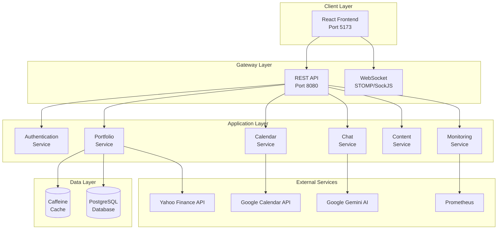
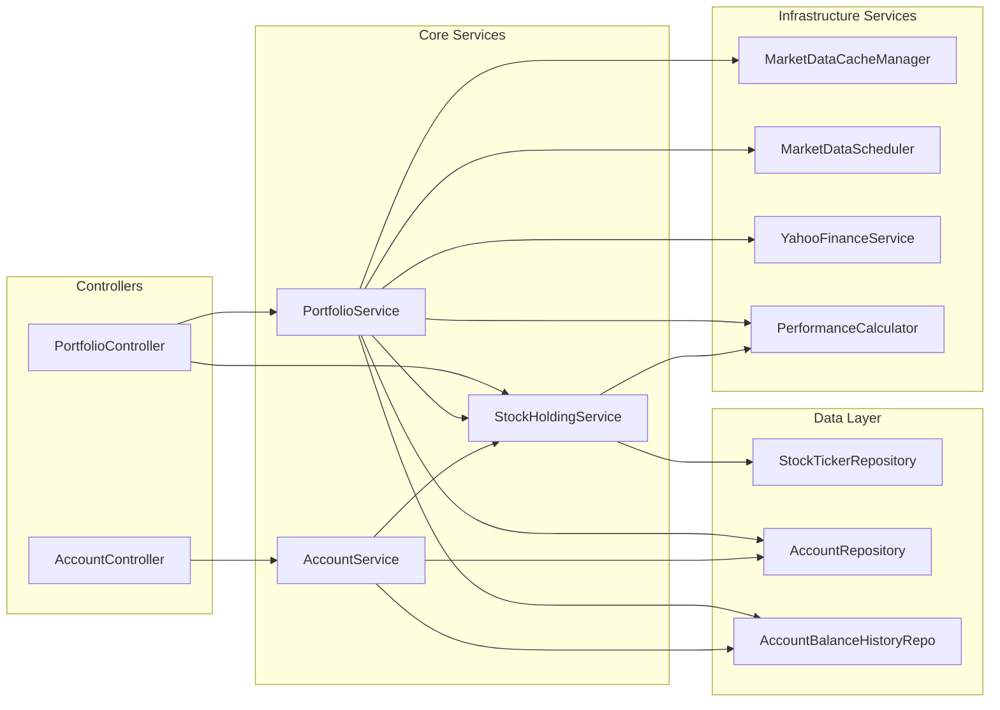
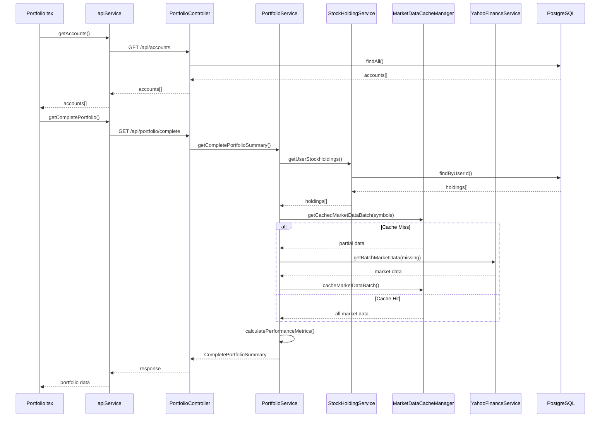
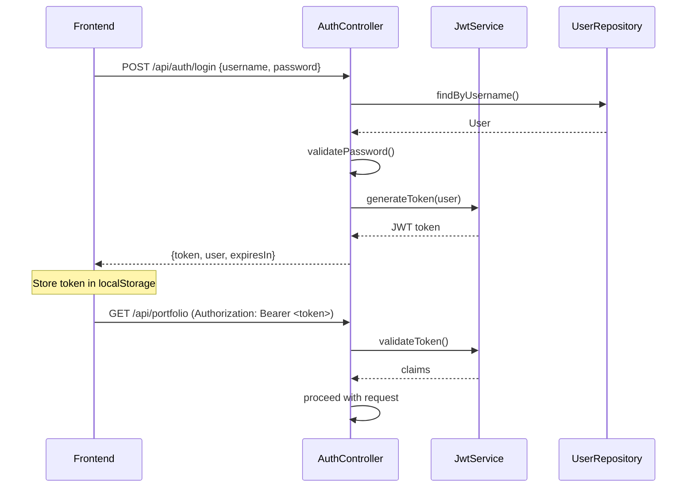

# Personal Dashboard - Architectural Design Document

## Table of Contents
1. [System Overview](#system-overview)
2. [Technology Stack](#technology-stack)
3. [Architecture Layers](#architecture-layers)
4. [Service Connectivity](#service-connectivity)
5. [API Design](#api-design)
6. [Data Flow](#data-flow)
7. [Caching Strategy](#caching-strategy)
8. [External Integrations](#external-integrations)
9. [Code Quality Analysis](#code-quality-analysis)
10. [Performance Optimization Recommendations](#performance-optimization-recommendations)
11. [Security Architecture](#security-architecture)

---

## System Overview

Personal Dashboard is a comprehensive full-stack personal portfolio and life management application. The system follows a **layered architecture** with clear separation between presentation, business logic, and data access layers.



---

## Technology Stack

### Backend
| Technology | Version | Purpose |
|------------|---------|---------|
| Java | 21 | Core language with modern features |
| Spring Boot | 3.3.0 | Application framework |
| Spring Security | 6.x | Authentication & authorization |
| Spring AI | 1.0.0-M4 | Gemini AI integration |
| PostgreSQL | 12+ | Primary database |
| Caffeine | - | In-memory caching |
| Micrometer | - | Metrics collection |
| Lombok | - | Boilerplate reduction |
| jjwt | 0.12.3 | JWT token handling |

### Frontend
| Technology | Version | Purpose |
|------------|---------|---------|
| React | 18 | UI framework |
| TypeScript | - | Type safety |
| Vite | - | Build tool & dev server |
| Tailwind CSS | - | Styling |
| Axios | - | HTTP client |
| Recharts | - | Data visualization |
| SockJS/STOMP | - | WebSocket communication |

### Monitoring Stack
| Technology | Purpose |
|------------|---------|
| Prometheus | Metrics storage |
| Grafana | Visualization |
| AlertManager | Alert routing |
| Node Exporter | System metrics |
| cAdvisor | Container metrics |

---

## Architecture Layers

### 1. Presentation Layer (Frontend)

```
frontend/src/
├── pages/                    # Page components (8 pages)
│   ├── Dashboard.tsx         # Main dashboard
│   ├── Portfolio.tsx         # Financial portfolio
│   ├── Calendar.tsx          # Calendar view
│   ├── Chat.tsx              # AI chat interface
│   ├── Content.tsx           # Content management
│   ├── Monitoring.tsx        # Service health
│   ├── LifeEvents.tsx        # Life events tracking
│   └── LoginPage.tsx         # Authentication
├── components/               # Reusable UI components (33 items)
│   ├── Portfolio/            # Portfolio-specific (5 components)
│   ├── Monitoring/           # Monitoring widgets (5 components)
│   ├── Layout/               # Layout components
│   └── UI/                   # Generic UI elements
├── services/                 # API communication (4 services)
│   ├── apiService.ts         # Main API client (69 methods)
│   ├── authService.ts        # Auth utilities
│   ├── cacheService.ts       # Client-side caching
│   └── monitoringService.ts  # Metrics service
└── contexts/                 # React contexts (4 contexts)
```

### 2. Controller Layer (API)

```
backend/.../controller/       # 19 Controllers
├── AuthenticationController  # JWT auth, login/logout
├── PortfolioController       # Stock portfolio (22 endpoints)
├── AccountController         # Financial accounts
├── AccountSnapshotController # Historical snapshots
├── CalendarController        # Google Calendar integration
├── ChatController            # AI chat
├── ContentController         # Social media, media tracking
├── GardenController          # Digital garden
├── LifeLogController         # Life logging
├── MonitoringController      # Health metrics
├── NewsController            # AI-curated news feed
├── PrometheusController      # Prometheus integration
├── ReportingController       # Data export
├── SignalsController         # Life signals
├── WatchlistController       # Stock watchlist
└── ...                       # Additional controllers
```

### 3. Service Layer (Business Logic)

```
backend/.../service/          # 60 Services
├── PORTFOLIO DOMAIN
│   ├── PortfolioService          # Main orchestrator (18 methods)
│   ├── StockHoldingService       # CRUD operations (14 methods)
│   ├── PerformanceCalculator     # Gain/loss calculations
│   ├── MarketDataCacheManager    # Cache management (21 methods)
│   ├── MarketDataScheduler       # Background updates
│   ├── YahooFinanceService       # External API client
│   └── HistoricalPortfolioService
│
├── ACCOUNT DOMAIN
│   ├── AccountService            # Account CRUD
│   └── AccountSnapshotService    # Daily snapshots
│
├── CALENDAR DOMAIN
│   ├── GoogleCalendarClient      # API client
│   ├── GoogleCalendarEventManager
│   ├── GoogleCalendarCacheManager
│   └── GoogleCalendarAuthManager
│
├── AI DOMAIN
│   ├── ChatService               # Chat orchestration
│   ├── GeminiChatClient          # AI client
│   └── ConversationContextManager
│
├── CONTENT DOMAIN
│   ├── SocialMediaPostService
│   ├── MediaActivityService
│   ├── QuickFactService
│   └── TripService
│
├── NEWS DOMAIN (NEW)
│   └── NewsService               # AI-powered news with LLM ranking
│
└── MONITORING DOMAIN
    ├── MetricsService
    ├── ServiceHealthService
    └── CacheMetricsService
```

### 4. Repository Layer (Data Access)

```
backend/.../repository/       # 19 Repositories
├── AccountRepository
├── AccountBalanceHistoryRepository
├── StockTickerRepository     # Complex queries for stocks
├── StockTransactionRepository
├── StockDailyPriceRepository
├── UserRepository
├── SocialMediaPostRepository
├── MediaActivityRepository
├── QuickFactRepository
├── TripRepository
├── LifeLogRepository
├── GardenRepository
├── FamilyMemberRepository
├── WatchlistRepository
├── PaperTransactionRepository
├── NewsCategoryRepository    # News topics/tabs
└── NewsArticleRepository     # Curated articles with relevanceScore
```

### 5. Model Layer (Entities)

```
backend/.../model/            # 30 Entities
├── CORE
│   ├── User
│   └── Role (enum)
│
├── FINANCIAL
│   ├── Account
│   ├── AccountBalanceHistory
│   ├── StockTicker
│   ├── StockTransaction
│   ├── StockDailyPrice
│   ├── CurrentStockPrice
│   ├── WatchlistItem
│   └── PaperTransaction
│
├── NEWS (NEW)
│   ├── NewsCategory         # Topics with tabs (Politics, Entertainment, Science, etc.)
│   └── NewsArticle          # Articles with LLM-generated relevanceScore (1-10)
│
├── CONTENT
│   ├── SocialMediaPost
│   ├── MediaActivity
│   ├── MediaType (enum)
│   ├── QuickFact
│   └── CalendarEvent
│
├── LIFE LOG
│   ├── LifeLogEntry
│   ├── LifeLogType (enum)
│   └── FamilyMember
│
├── GARDEN
│   ├── GardenNote
│   ├── GrowthStage (enum)
│   └── UpcomingTrip
│
└── AI/SETTINGS
    ├── ChatMessage
    ├── ConversationContext
    └── GlobalSetting
```

---

## Service Connectivity



---

## API Design

### REST Endpoints Overview

| Domain | Base Path | Key Endpoints |
|--------|-----------|---------------|
| Auth | `/api/auth` | `POST /login`, `POST /logout`, `GET /me` |
| Portfolio | `/api/portfolio` | `GET /`, `GET /complete`, `POST /refresh`, `GET /history` |
| Holdings | `/api/portfolio/holdings` | `GET /`, `POST /`, `PUT /{symbol}`, `DELETE /{symbol}` |
| Accounts | `/api/accounts` | `GET /`, `GET /{id}`, `POST /`, `PUT /{id}/balance`, `DELETE /{id}` |
| Snapshots | `/api/snapshots` | `POST /backfill`, `POST /fill-missing` |
| Calendar | `/api/calendar` | `GET /events`, `POST /events`, `PUT /events/{id}` |
| Chat | `/api/chat` | `POST /message`, `GET /history` |
| Content | `/api/content` | `GET /posts`, `POST /posts`, `GET /quick-facts` |
| **News** | `/api/news` | `GET /`, `GET /categories`, `POST /categories`, `DELETE /categories/{id}`, `POST /refresh` |
| Monitoring | `/api/monitoring` | `GET /health`, `GET /metrics` |

### Response Pattern

All API responses follow a consistent wrapper pattern:

```typescript
interface PortfolioResponse<T> {
  success: boolean;
  data?: T;
  error?: string;
  message?: string;
  timestamp: string;
}
```

---

## Data Flow

### Financial Tab Data Loading Flow



### Current Issue: Sequential API Calls

The financial tab makes **sequential blocking calls**:
1. `getAccounts()` → wait for response
2. `loadStockData()` → parallel calls to `getTransactions()` + `getHoldings()`
3. `getCompletePortfolio()` (if PortfolioOverview)

This pattern creates unnecessary wait times.

---

## Caching Strategy

### Backend Caching (Caffeine)

```java
// MarketDataCacheManager - Intelligent caching with TTL
private Map<String, Long> cacheTimestamps = new ConcurrentHashMap<>();
private AtomicLong cacheHits = new AtomicLong(0);
private AtomicLong cacheMisses = new AtomicLong(0);

// Cache configuration
- TTL during market hours: 5 minutes (configurable)
- TTL during off-hours: 30 minutes
- Max cache size: Configurable
- Supports batch operations
- Access frequency tracking for cache warming
```

### Frontend Caching (cacheService)

```typescript
// Client-side caching with configurable TTL
// apiService.ts uses cachedGet() for read operations
async cachedGet<T>(url: string, cacheKey: string, ttlMs?: number): Promise<T>
```

### Cache Hierarchy

```
┌─────────────────────────────────────────┐
│  Frontend Cache (cacheService)          │  TTL: 30s-5min
│  - Portfolio data                       │
│  - Quick facts                          │
│  - News articles                        │
├─────────────────────────────────────────┤
│  Backend Cache (Caffeine)               │  TTL: 5-30min
│  - Market data (MarketDataCacheManager) │
│  - Calendar events (GoogleCalendarCacheManager)
│  - URL/Book metadata (MetadataCacheManager)
│  - Stock prices (StockPriceCacheService)
├─────────────────────────────────────────┤
│  Database (PostgreSQL)                  │  Persistent
│  - Holdings, Transactions               │
│  - Account snapshots                    │
│  - Historical prices                    │
│  - News articles with relevanceScore    │
└─────────────────────────────────────────┘
```

### Backend Cache Managers

| Cache Manager | Purpose | TTL | Key Features |
|---------------|---------|-----|----------|
| `MarketDataCacheManager` | Stock prices | 5-30 min | Market-hours aware, batch ops, frequency tracking |
| `GoogleCalendarCacheManager` | Calendar events | Configurable | Event synchronization |
| `MetadataCacheManager` | URL/Book metadata | Long-term | ISBN, IMDB lookups |
| `StockPriceCacheService` | Historical prices | Daily | Chart data caching |
| `CacheMetricsService` | Monitoring | N/A | Hit/miss tracking, Prometheus metrics |

---

## External Integrations

### Yahoo Finance API
- **Purpose**: Real-time and historical stock prices
- **Client**: `YahooFinanceService`
- **Caching**: `MarketDataCacheManager` with intelligent TTL
- **Methods**: `getBatchMarketData()`, `getHistoricalPrices()`

### NewsAPI
- **Purpose**: News article aggregation
- **Client**: `NewsService`
- **LLM Integration**: Gemini for relevance scoring (1-10) and summarization
- **Default Categories**: US Politics, Trending Entertainment, Science Breakthroughs

### Google Calendar API
- **Purpose**: Calendar event synchronization
- **Client**: `GoogleCalendarClient`
- **Auth**: OAuth 2.0 via `GoogleCalendarAuthManager`
- **Caching**: `GoogleCalendarCacheManager`

### Google Gemini AI
- **Purpose**: AI chat assistant
- **Client**: `GeminiChatClient` via Spring AI
- **Context**: `ConversationContextManager`
- **Functions**: Tool calling for portfolio/calendar queries

### Prometheus
- **Purpose**: Metrics collection and querying
- **Integration**: Micrometer registry
- **Endpoint**: `/actuator/prometheus`
- **Client**: `PrometheusQueryService`

---

## Code Quality Analysis

### SOLID Principles Assessment

#### ✅ Single Responsibility Principle (SRP)
**Good Examples:**
- `MarketDataCacheManager` - Only handles caching logic
- `PerformanceCalculator` - Only calculates metrics
- `YahooFinanceService` - Only fetches external data

**Violations:**
- `PortfolioService` (563 lines) - Does too much: orchestration, data fetching, account updates

#### ✅ Open/Closed Principle (OCP)
**Good Examples:**
- `Account.AccountType` enum allows extension
- Strategy pattern implicit in services

#### ⚠️ Liskov Substitution Principle (LSP)
- Not heavily used since there's minimal inheritance

#### ✅ Interface Segregation Principle (ISP)
**Good Examples:**
- Small, focused repository interfaces
- DTOs are well-segregated

#### ⚠️ Dependency Inversion Principle (DIP)
**Issues:**
- Hardcoded `userId = 1L` in `AccountService` violates DIP
- Direct concrete class dependencies in some services

### Modularity Assessment

| Aspect | Rating | Notes |
|--------|--------|-------|
| Package Structure | ⭐⭐⭐⭐⭐ | Clear domain-based organization |
| Service Layering | ⭐⭐⭐⭐ | Good separation, some coupling |
| DTOs | ⭐⭐⭐⭐⭐ | Well-defined, 34 DTOs |
| Configuration | ⭐⭐⭐⭐ | 16 config classes, well organized |
| Testing | ⭐⭐⭐ | 16 test files, could be more |

### Code Smells Identified

1. **Hardcoded User ID**
   ```java
   // AccountService.java:37
   Long userId = 1L; // User Context - HARDCODED
   ```

2. **Large Service Classes**
   - `PortfolioService`: 563 lines
   - `StockHoldingService`: 615 lines
   - `MediaActivityService`: 20,406 bytes

3. **Missing Error Handling Specificity**
   - Generic `Exception` catches in some services

4. **Synchronous Blocking in History Fetch**
   ```java
   // PortfolioService.java:329
   historicalPortfolioService.getReconstructedHistory(...).block();
   ```

---

## Performance Optimization Recommendations

### 🔴 High Priority: Financial Tab Performance

#### Issue 1: Sequential API Calls on Page Load

**Current Flow:**
```
Portfolio.tsx mount → getAccounts() → wait → render
AccountDetails.tsx mount → getTransactions() + getHoldings() → wait
```

**Recommendation: Parallel Data Loading**

```typescript
// BEFORE (sequential)
useEffect(() => {
  fetchAccounts();
}, []);

// AFTER (parallel with eager loading)
useEffect(() => {
  Promise.all([
    apiService.getAccounts(),
    apiService.getCompletePortfolio(),
    apiService.getTransactions(),
    apiService.getHoldings()
  ]).then(([accounts, portfolio, transactions, holdings]) => {
    setAccounts(accounts.data);
    setPortfolio(portfolio.data);
    // Pre-cache for AccountDetails
    window.__portfolioCache = { transactions, holdings };
  });
}, []);
```

#### Issue 2: Blocking `.block()` Call in History Service

**Current:**
```java
// PortfolioService.java:329
List<PortfolioHistoryPoint> history = 
    historicalPortfolioService.getReconstructedHistory(userId, period).block();
```

**Recommendation: Async Response**
```java
// Return Mono and let controller handle async
public Mono<PortfolioResponse<List<PortfolioHistoryPoint>>> getPortfolioHistoryAsync(
    Long userId, String period) {
    return historicalPortfolioService.getReconstructedHistory(userId, period)
        .map(history -> PortfolioResponse.success(history, "Success"));
}
```

#### Issue 3: N+1 Query Pattern in Account Calculation

**Current:**
```java
// AccountService.java:64-73
response.getData().stream()
    .map(StockTicker::getCurrentValue)  // Each ticker may trigger lazy load
```

**Recommendation: Eager Fetch Join**
```java
@Query("SELECT s FROM StockTicker s LEFT JOIN FETCH s.transactions WHERE s.userId = :userId")
List<StockTicker> findByUserIdWithTransactions(@Param("userId") Long userId);
```

### 🟡 Medium Priority

#### 4. Add API Response Compression
```yaml
# application.yml
server:
  compression:
    enabled: true
    mime-types: application/json
    min-response-size: 1024
```

#### 5. Implement Connection Pooling Tuning
```yaml
spring:
  datasource:
    hikari:
      maximum-pool-size: 20
      minimum-idle: 5
      connection-timeout: 20000
```

#### 6. Add Cache Prewarming on Startup
```java
@EventListener(ApplicationReadyEvent.class)
public void warmCacheOnStartup() {
    List<String> frequentSymbols = stockRepository.findMostAccessedSymbols(10);
    cacheManager.warmCache(frequentSymbols);
}
```

### 🟢 Low Priority

#### 7. Frontend Bundle Optimization
- Code split Portfolio components
- Lazy load Recharts

#### 8. Add Database Indexes
```sql
CREATE INDEX idx_stock_ticker_user_symbol ON stock_ticker(user_id, symbol);
CREATE INDEX idx_account_history_date ON account_balance_history(account_id, date);
CREATE INDEX idx_transactions_date ON stock_transaction(transaction_date);
```

#### 9. Implement Request Debouncing
```typescript
// Frontend: Debounce refresh button
const debouncedRefresh = useMemo(
  () => debounce(() => apiService.refreshPortfolio(), 1000),
  []
);
```

---

## Security Architecture

### Authentication Flow



### Security Configuration Highlights

- **JWT-based stateless authentication**
- **BCrypt password hashing**
- **Role-based access control** (ADMIN, GUEST)
- **CORS configuration** for frontend origin
- **CSRF protection disabled** (using JWT)
- **Public endpoints**: `/api/auth/**`, `/actuator/**`

---

## Summary

### Strengths
1. **Clean layered architecture** with clear separation of concerns
2. **Comprehensive caching** with intelligent TTL management
3. **Well-structured API** with consistent response patterns
4. **Good test coverage** with 16 test files
5. **Modern technology stack** (Java 21, Spring Boot 3.3, React 18)
6. **Production-ready monitoring** with Prometheus/Grafana

### Areas for Improvement
1. Fix hardcoded `userId = 1L` for multi-user support
2. Refactor large service classes (>500 lines)
3. Implement parallel data loading for financial tab
4. Remove blocking `.block()` calls in async services
5. Add database indexes for performance
6. Increase test coverage for services

---

*Document updated: 2026-02-09*
*Version: 1.1*
