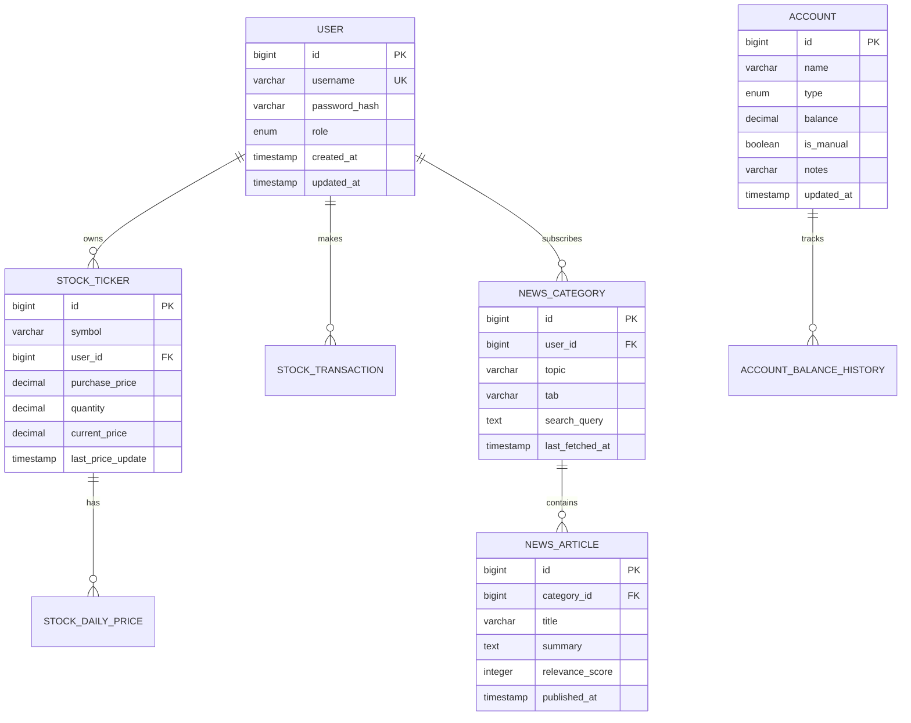

# Database Schema Reference

Complete database schema documentation for Personal Dashboard.

---

## Entity Relationship Diagram

---

## Core Domain Tables

### `users`
Authentication and user management.

| Column | Type | Constraints | Description |
|--------|------|-------------|-------------|
| `id` | BIGINT | PK, AUTO | User ID |
| `username` | VARCHAR(50) | NOT NULL, UNIQUE | Login username |
| `password_hash` | VARCHAR | NOT NULL | BCrypt hash |
| `role` | ENUM | NOT NULL | ADMIN, GUEST |
| `created_at` | TIMESTAMP | | Account creation |
| `updated_at` | TIMESTAMP | | Last update |

---

## Financial Domain

### `accounts`
Financial account tracking.

| Column | Type | Constraints | Description |
|--------|------|-------------|-------------|
| `id` | BIGINT | PK, AUTO | Account ID |
| `name` | VARCHAR(100) | NOT NULL | Display name |
| `type` | ENUM | NOT NULL | STOCK_PORTFOLIO, CASH, RETIREMENT, EDUCATION, OTHER |
| `balance` | DECIMAL(19,4) | NOT NULL, DEFAULT 0 | Current balance |
| `is_manual` | BOOLEAN | DEFAULT TRUE | Manual vs calculated |
| `notes` | VARCHAR(500) | | Optional notes |
| `updated_at` | TIMESTAMP | | Last update |

**Indexes:** `idx_account_type(type)`

### `stock_tickers`
Individual stock holdings with real-time market data.

| Column | Type | Constraints | Description |
|--------|------|-------------|-------------|
| `id` | BIGINT | PK, AUTO | Ticker ID |
| `symbol` | VARCHAR(10) | NOT NULL | Stock symbol (e.g., AAPL) |
| `user_id` | BIGINT | NOT NULL | Owner user |
| `purchase_price` | DECIMAL(19,4) | NOT NULL | Cost basis per share |
| `quantity` | DECIMAL(19,8) | NOT NULL | Shares owned |
| `current_price` | DECIMAL(19,4) | | Real-time price |
| `daily_change` | DECIMAL(19,4) | | Today's change ($) |
| `daily_change_percentage` | DECIMAL(10,4) | | Today's change (%) |
| `last_price_update` | TIMESTAMP | | Price freshness |
| `is_market_open` | BOOLEAN | | Market status |
| `notes` | VARCHAR(500) | | Optional notes |
| `created_at` | TIMESTAMP | | Creation time |
| `updated_at` | TIMESTAMP | | Last update |

**Indexes:** `idx_stock_symbol`, `idx_stock_user_id`, `idx_stock_user_symbol`, `idx_stock_created_at`

### `stock_transactions`
Buy/sell transaction history.

| Column | Type | Constraints | Description |
|--------|------|-------------|-------------|
| `id` | BIGINT | PK, AUTO | Transaction ID |
| `user_id` | BIGINT | NOT NULL | Owner user |
| `symbol` | VARCHAR(10) | NOT NULL | Stock symbol |
| `type` | ENUM | NOT NULL | BUY, SELL |
| `transaction_date` | DATE | NOT NULL | Transaction date |
| `quantity` | DECIMAL(19,8) | NOT NULL | Shares transacted |
| `price_per_share` | DECIMAL(19,4) | NOT NULL | Price at transaction |
| `total_cost` | DECIMAL(19,4) | | Total including fees |
| `notes` | VARCHAR(500) | | Transaction notes |
| `created_at` | TIMESTAMP | | Record creation |

**Indexes:** `idx_txn_user_id`, `idx_txn_symbol`, `idx_txn_date`

### `account_balance_history`
Daily balance snapshots for historical charts.

| Column | Type | Constraints | Description |
|--------|------|-------------|-------------|
| `id` | BIGINT | PK, AUTO | Record ID |
| `account_id` | BIGINT | NOT NULL | Parent account |
| `date` | DATE | NOT NULL | Snapshot date |
| `balance` | DECIMAL(19,4) | NOT NULL | Balance on date |
| `recorded_at` | TIMESTAMP | | When recorded |

**Indexes:** `idx_hist_account_id`, `idx_hist_date`

### `stock_daily_prices`
Historical stock prices for charts.

| Column | Type | Constraints | Description |
|--------|------|-------------|-------------|
| `id` | BIGINT | PK, AUTO | Record ID |
| `symbol` | VARCHAR(10) | NOT NULL | Stock symbol |
| `date` | DATE | NOT NULL | Price date |
| `open_price` | DECIMAL(19,4) | | Opening price |
| `high_price` | DECIMAL(19,4) | | Day high |
| `low_price` | DECIMAL(19,4) | | Day low |
| `close_price` | DECIMAL(19,4) | | Closing price |
| `volume` | BIGINT | | Trading volume |

### `watchlist_items`
User stock watchlist.

| Column | Type | Constraints | Description |
|--------|------|-------------|-------------|
| `id` | BIGINT | PK, AUTO | Item ID |
| `user_id` | BIGINT | NOT NULL | Owner |
| `symbol` | VARCHAR(10) | NOT NULL | Stock symbol |
| `added_at` | TIMESTAMP | | When added |

---

## News Domain

### `news_categories`
User-defined news topics and tabs.

| Column | Type | Constraints | Description |
|--------|------|-------------|-------------|
| `id` | BIGINT | PK, AUTO | Category ID |
| `user_id` | BIGINT | NOT NULL | Owner user |
| `topic` | VARCHAR | NOT NULL | Display name (e.g., "US Politics") |
| `tab` | VARCHAR | DEFAULT 'Misc' | Financial, Sports, Politics, Entertainment, Science, Misc |
| `search_query` | TEXT | | NewsAPI query string |
| `last_fetched_at` | TIMESTAMP | | Last refresh time |
| `created_at` | TIMESTAMP | | Creation time |
| `updated_at` | TIMESTAMP | | Last update |

### `news_articles`
Individual news articles with LLM analysis.

| Column | Type | Constraints | Description |
|--------|------|-------------|-------------|
| `id` | BIGINT | PK, AUTO | Article ID |
| `category_id` | BIGINT | FK, NOT NULL | Parent category |
| `title` | VARCHAR | NOT NULL | Article headline |
| `summary` | TEXT | | AI-generated 3-sentence summary |
| `content` | TEXT | | AI-generated detailed analysis |
| `url` | VARCHAR | | Original article link |
| `image_url` | VARCHAR | | Thumbnail image |
| `source` | VARCHAR | | Publisher name |
| `published_at` | TIMESTAMP | | Original publish time |
| `relevance_score` | INTEGER | DEFAULT 5 | LLM ranking 1-10 |
| `created_at` | TIMESTAMP | | Import time |

---

## Content Domain

### `media_activity`
Books, movies, TV shows, music tracking.

| Column | Type | Constraints | Description |
|--------|------|-------------|-------------|
| `id` | BIGINT | PK, AUTO | Activity ID |
| `title` | VARCHAR | NOT NULL | Media title |
| `media_type` | ENUM | | BOOK, MOVIE, TV_SHOW, MUSIC, GAME |
| `status` | ENUM | | PLANNED, IN_PROGRESS, COMPLETED |
| `creator` | VARCHAR | | Author/Director/Artist |
| `cover_url` | VARCHAR | | Cover image |
| `rating` | INTEGER | | 1-5 rating |
| `start_date` | DATE | | Started watching/reading |
| `completion_date` | DATE | | Finished date |
| `notes` | TEXT | | Personal notes |
| `external_id` | VARCHAR | | ISBN, IMDB ID, etc. |
| `genre` | VARCHAR | | Genre classification |

### `life_log`
Personal life event tracking.

| Column | Type | Constraints | Description |
|--------|------|-------------|-------------|
| `id` | BIGINT | PK, AUTO | Entry ID |
| `title` | VARCHAR | NOT NULL | Event name |
| `type` | ENUM | NOT NULL | BOOK, MOVIE, SHOW, ALBUM, HOBBY |
| `start_date` | DATE | | Start date |
| `end_date` | DATE | | End date |
| `status` | ENUM | | IN_PROGRESS, COMPLETED, PLANNED |
| `rating` | INTEGER | | Mahoney Rating (1-5) |
| `key_takeaway` | VARCHAR(500) | | Main insight |
| `intensity` | INTEGER | | Hobby intensity (1-5) |
| `metadata` | TEXT | | JSON additional data |

### `garden_notes`
Digital garden/notes system.

| Column | Type | Constraints | Description |
|--------|------|-------------|-------------|
| `id` | BIGINT | PK, AUTO | Note ID |
| `title` | VARCHAR | NOT NULL | Note title |
| `content` | TEXT | | Note content |
| `growth_stage` | ENUM | | SEED, SPROUT, GROWING, EVERGREEN |
| `tags` | VARCHAR | | Comma-separated tags |
| `created_at` | TIMESTAMP | | Creation time |
| `updated_at` | TIMESTAMP | | Last update |

### `quick_facts`
Quick reference facts displayed on dashboard.

| Column | Type | Constraints | Description |
|--------|------|-------------|-------------|
| `id` | BIGINT | PK, AUTO | Fact ID |
| `category` | VARCHAR | NOT NULL | Grouping category |
| `label` | VARCHAR | NOT NULL | Display label |
| `value` | VARCHAR | NOT NULL | Fact value |
| `user_id` | BIGINT | | Owner user |

### `upcoming_trips`
Travel planning.

| Column | Type | Constraints | Description |
|--------|------|-------------|-------------|
| `id` | BIGINT | PK, AUTO | Trip ID |
| `destination` | VARCHAR | NOT NULL | Trip location |
| `start_date` | DATE | | Departure date |
| `end_date` | DATE | | Return date |
| `type` | ENUM | | VACATION, BUSINESS, FAMILY |
| `status` | ENUM | | PLANNING, BOOKED, COMPLETED |
| `notes` | TEXT | | Trip notes |

### `family_members`
Family member tracking.

| Column | Type | Constraints | Description |
|--------|------|-------------|-------------|
| `id` | BIGINT | PK, AUTO | Member ID |
| `name` | VARCHAR | NOT NULL | Full name |
| `relationship` | VARCHAR | | Relationship type |
| `birthday` | DATE | | Birth date |
| `notes` | TEXT | | Notes |

---

## AI/Chat Domain

### `chat_messages`
AI conversation history.

| Column | Type | Constraints | Description |
|--------|------|-------------|-------------|
| `id` | BIGINT | PK, AUTO | Message ID |
| `user_id` | BIGINT | | Owner user |
| `role` | VARCHAR | | user, assistant |
| `content` | TEXT | | Message content |
| `created_at` | TIMESTAMP | | Send time |

### `conversation_context`
Long-term conversation memory.

| Column | Type | Constraints | Description |
|--------|------|-------------|-------------|
| `id` | BIGINT | PK, AUTO | Context ID |
| `user_id` | BIGINT | | Owner user |
| `context_type` | VARCHAR | | Context category |
| `content` | TEXT | | Context content |
| `created_at` | TIMESTAMP | | Creation time |

---

## Settings

### `global_settings`
Application-wide settings.

| Column | Type | Constraints | Description |
|--------|------|-------------|-------------|
| `id` | BIGINT | PK, AUTO | Setting ID |
| `key` | VARCHAR | UNIQUE | Setting key |
| `value` | TEXT | | Setting value |

---

*Last updated: 2026-02-09*
